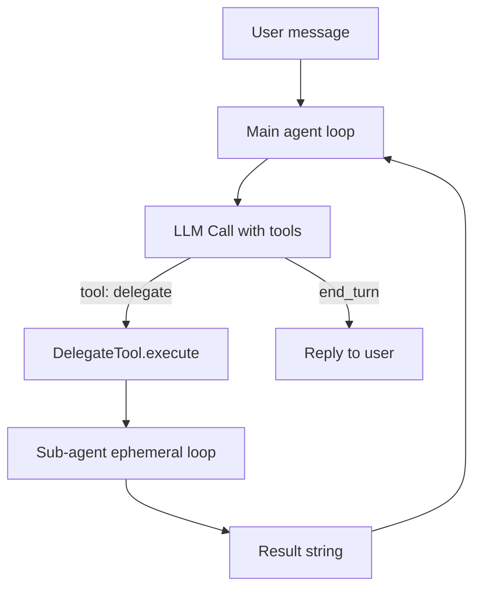

# Agent Delegation Architecture (Finalized)

## Overview

Implement **Option B: Inline Sub-Agent Tool** so the main agent can delegate focused tasks to a sub-agent via a `delegate` tool. The sub-agent runs an ephemeral tool loop (no session persistence) and returns a single result string to the main agent.

---

## Current State

- Single-loop agent in [src/channels/telegram.rs](src/channels/telegram.rs) (lines 986–1320+): one LLM with all tools.
- Config has `orchestrator_enabled` / `orchestrator_model` but they are **unused**.
- `src/tools/sub_agent.rs` was **deleted**; no existing delegate tool.
- App state is built in [src/channels/telegram.rs](src/channels/telegram.rs) L122–150: `llm` created, then `ToolRegistry::new(config, bot, db)`, then MCP tools added, then `AppState { llm, tools, ... }`.

---

## Architecture




**Key points:**

- Main agent keeps full context and all tools (including `delegate`).
- Sub-agent gets a **task prompt** only; no conversation history.
- Sub-agent uses the **same** tool set (or a filtered subset) and inherits **ToolAuthContext** (persona scope).
- No session load/save for sub-agent; no TSA/PTE in sub-agent loop.

---

## Implementation Plan

### 1. Extract Ephemeral Agent Loop

The sub-agent needs a loop that is a subset of the main loop: LLM + tools, no session, no TSA, no PTE.

**Option A (recommended):** Add a shared function that runs the core loop and call it from both the main path and the delegate tool.

- **New module:** [src/agent_loop.rs](src/agent_loop.rs) (or keep in telegram and make a `pub async fn` used by delegate).
- **Signature (conceptual):**

```rust
/// Run an ephemeral agent loop (no session, no TSA, no PTE). Returns final assistant text or error.
pub async fn run_ephemeral_loop(
    config: &Config,
    llm: &dyn LlmProvider,
    tools: &ToolRegistry,
    system_prompt: &str,
    mut messages: Vec<Message>,
    auth: &ToolAuthContext,
    max_iterations: usize,
    llm_timeout_secs: u64,
    tool_timeout_secs: u64,
) -> Result<String, MicroClawError>
```

- **Behavior:** Same as current loop: iterate; on `end_turn`/`max_tokens` return text; on `tool_use` run `tools.execute_with_auth`, append results, continue. Do **not** save session, call TSA, or call PTE.
- **Location:** Either:
  - Implement in [src/channels/telegram.rs](src/channels/telegram.rs) as a `pub(crate)` or `pub` async fn and have the main `process_with_agent_with_events` call it for the “inner” loop (then refactor main loop to use it for the single-loop case), or
  - Implement in a new [src/agent_loop.rs](src/agent_loop.rs) used by both telegram and the delegate tool.

**Option B (minimal):** Duplicate a simplified loop inside the delegate tool only (no extraction). Faster to ship but duplicates logic and drift risk; not recommended.

**Recommendation:** Option A. Add [src/agent_loop.rs](src/agent_loop.rs) with `run_ephemeral_loop`. Then:

- Main loop in telegram can stay as-is for now (still inline), and only the **delegate tool** calls `run_ephemeral_loop`; or
- Refactor telegram to use `run_ephemeral_loop` for the main loop as well (cleaner long-term).

For “finalize the plan” we specify: **add `run_ephemeral_loop` in a new module; delegate tool is the first consumer.**

### 2. Delegate Tool

**New file:** [src/tools/delegate.rs](src/tools/delegate.rs)

**Struct:**

- Holds: `Config` (or `Arc<Config>`), `Arc<Database>`, `Bot` (or minimal clone), and **LLM**: `Arc<dyn LlmProvider>` (or `Box<dyn LlmProvider>`; must be `Send + Sync` for `Tool`).
- Does **not** hold `ToolRegistry`; in `execute` it builds a **new** `ToolRegistry::new(config, bot, db)` for the sub-agent to avoid circular dependency.

**Tool contract:**

- **Name:** `"delegate"`.
- **Input schema (JSON):**
  - `task` (string, required): The instruction for the sub-agent (e.g. “Search the web for X and summarize in 3 bullets”).
  - `context` (string, optional): Extra context to prepend to the task (e.g. “User asked: …”).
  - `max_iterations` (integer, optional): Override for sub-agent loop (default from config).

**Execution:**

1. Parse `task` (and optional `context`); get `auth` from `auth_context_from_input(&input)`.
2. Build sub-agent system prompt (short: “You are a focused assistant. Complete the following task. Use tools as needed. Reply with a single final answer.”).
3. Build `messages`: one user message = `context.map_or_else(|| task.clone(), |c| format!("{}\n\nTask: {}", c, task))`.
4. Create `ToolRegistry::new(config, bot, db)` for sub-agent (same bot/db as main; config from constructor).
5. Call `run_ephemeral_loop(config, llm, &sub_registry, &system_prompt, messages, auth, max_iterations, 180, 120)`.
6. Return `ToolResult::success(result)` or `ToolResult::error(...)`.

**Config:** Use `config.delegate_max_iterations` (default 10), optional `config.delegate_model` (if set, use a separate provider for sub-agent; else use same `llm`). If we add `delegate_model`, the delegate tool would need an optional second LLM or we use the same one for simplicity in v1.

### 3. Config

**In [src/config.rs](src/config.rs):**

- `delegate_tool_enabled: bool` (default `true`).
- `delegate_max_iterations: usize` (default `10`).
- `delegate_model: String` (default empty; if non-empty, use for sub-agent; else use main model). Optional for v1.

**Env:** `DELEGATE_TOOL_ENABLED`, `DELEGATE_MAX_ITERATIONS`, `DELEGATE_MODEL`.

**Registration:** Only register the `delegate` tool when `delegate_tool_enabled` is true. So in the place that builds the registry, after `ToolRegistry::new`, if config says enabled, `tools.add_tool(Box::new(DelegateTool::new(...)))`. That requires the registry to be built where we have `llm` — which is in telegram.rs (and web.rs for tests). So:

- In [src/channels/telegram.rs](src/channels/telegram.rs) around L123: after `let mut tools = ToolRegistry::new(...)`, if `config.delegate_tool_enabled`, add `tools.add_tool(Box::new(DelegateTool::new(config, bot.clone(), db.clone(), llm.clone())))`. That implies `llm` is created before the registry and we need to pass it in; currently `llm` is created at L122 and `tools` at L123, so we have both. We need to change to: create `llm`, create `tools`, then if delegate enabled, add `DelegateTool::new(&config, bot.clone(), db.clone(), llm.clone())`. So `DelegateTool` needs to hold something like `Arc<dyn LlmProvider>` (llm is already `Box<dyn LlmProvider>` in AppState; we can use the same and clone the Box, or wrap in Arc). Easiest: pass `llm: Arc<dyn LlmProvider>`. So when building AppState we need to wrap llm in Arc, or we keep Box and the delegate holds a reference. Actually AppState has `pub llm: Box<dyn LlmProvider>`. So we can do `tools.add_tool(Box::new(DelegateTool::new(..., state.llm)))` only after state exists — but state contains tools, so we can’t add to tools after state. So we must add delegate when building tools, and at that point we have `llm` as a local variable (Box). So DelegateTool::new(config, bot, db, llm) — we need to pass the llm. So we need either Arc or &dyn LlmProvider. The tool is stored in the registry and must own or share the llm. So we need Arc. So when building state we do: let llm = create_provider(); let llm = Arc::new(llm); let mut tools = ToolRegistry::new(...); tools.add_tool(DelegateTool::new(..., llm.clone())); ... AppState { llm, tools }. So AppState would need to hold Arc instead of Box. That’s a small change (all usages of state.llm would stay the same if they use .send_message etc.). So plan: (1) Change AppState.llm to Arc. (2) In telegram init: llm = Arc::new(create_provider(&config)); then build tools and add delegate with llm.clone(). (3) DelegateTool holds Arc.

### 4. Tool Registry Construction

- **Telegram:** [src/channels/telegram.rs](src/channels/telegram.rs): Create `llm` as `Arc::new(create_provider(&config))`, then `ToolRegistry::new(...)`, then if `config.delegate_tool_enabled` add `DelegateTool::new(config.clone(), bot.clone(), db.clone(), llm.clone())`. Then build AppState with `llm` (Arc).
- **Web test state:** Same pattern if it instantiates a full registry with delegate.
- **main.rs:** Tool test path may not need delegate; optional.

### 5. Persona / Auth

- `ToolAuthContext` is injected into tool input by the main loop via `inject_auth_context`. So when the main agent calls `delegate`, the input will contain auth. `DelegateTool::execute` uses `auth_context_from_input` and passes that auth into `run_ephemeral_loop`. So sub-agent tool calls (e.g. read_tiered_memory, read_memory) see the same `caller_chat_id` and `caller_persona_id`; no change needed.

### 6. Risk and tool_risk()

- Add `"delegate"` to `tool_risk()` in [src/tools/mod.rs](src/tools/mod.rs). Suggest `ToolRisk::Medium` (sub-agent can run tools on user’s behalf).

### 7. .env.example

- Document `DELEGATE_TOOL_ENABLED`, `DELEGATE_MAX_ITERATIONS`, `DELEGATE_MODEL`.

---

## Files to Create or Modify


| File                                                 | Action                                                                                                                                                                                                                   |
| ---------------------------------------------------- | ------------------------------------------------------------------------------------------------------------------------------------------------------------------------------------------------------------------------ |
| [src/agent_loop.rs](src/agent_loop.rs)               | **New**: `run_ephemeral_loop(...)` with no session, TSA, or PTE.                                                                                                                                                         |
| [src/tools/delegate.rs](src/tools/delegate.rs)       | **New**: `DelegateTool`, input schema, call `run_ephemeral_loop`.                                                                                                                                                        |
| [src/tools/mod.rs](src/tools/mod.rs)                 | Add `pub mod delegate`; register in `ToolRegistry::new` (or conditional add after), add `delegate` to `tool_risk()`.                                                                                                     |
| [src/channels/telegram.rs](src/channels/telegram.rs) | Create `llm` as `Arc::new(create_provider(...))`; after `ToolRegistry::new`, if `delegate_tool_enabled`, `tools.add_tool(Box::new(DelegateTool::new(..., llm.clone())))`; `AppState.llm` type to `Arc<dyn LlmProvider>`. |
| [src/config.rs](src/config.rs)                       | Add `delegate_tool_enabled`, `delegate_max_iterations`, `delegate_model` with defaults and env.                                                                                                                          |
| [src/lib.rs](src/lib.rs)                             | Add `pub mod agent_loop;` (if new module).                                                                                                                                                                               |
| [src/web.rs](src/web.rs)                             | If it builds AppState with tools, align with same delegate registration and `Arc<dyn LlmProvider>`.                                                                                                                      |
| [.env.example](.env.example)                         | Document delegate env vars.                                                                                                                                                                                              |


---

## Todos (Finalized)

1. **agent-loop-module** — Add [src/agent_loop.rs](src/agent_loop.rs) with `run_ephemeral_loop` (no session, TSA, PTE); same loop logic as main agent.
2. **delegate-tool** — Add [src/tools/delegate.rs](src/tools/delegate.rs): `DelegateTool`, schema `task`/`context`/`max_iterations`, call `run_ephemeral_loop` with sub-agent `ToolRegistry`.
3. **config-delegate** — Add delegate config fields and env in [src/config.rs](src/config.rs); wire in config_wizard and tests.
4. **registry-llm** — In [src/channels/telegram.rs](src/channels/telegram.rs): `llm` as `Arc<dyn LlmProvider>`, register `DelegateTool` when enabled; update [src/web.rs](src/web.rs) and any other AppState builders.
5. **tool-risk-env** — Add `delegate` to `tool_risk()` in [src/tools/mod.rs](src/tools/mod.rs); update [.env.example](.env.example).

---

## Summary

- **Delegate tool** = one new tool the main agent can call with a `task` (and optional `context`). It runs a sub-agent with an ephemeral loop and returns the result string.
- **Ephemeral loop** = shared `run_ephemeral_loop` in a new module (or in telegram) so the delegate tool (and optionally the main path) use the same loop logic without session/TSA/PTE.
- **No circular dependency:** sub-agent uses a **new** `ToolRegistry::new(config, bot, db)` created inside the delegate’s `execute`.
- **Persona:** Sub-agent uses the same `ToolAuthContext` from the delegate call, so memory and auth stay persona-scoped.

