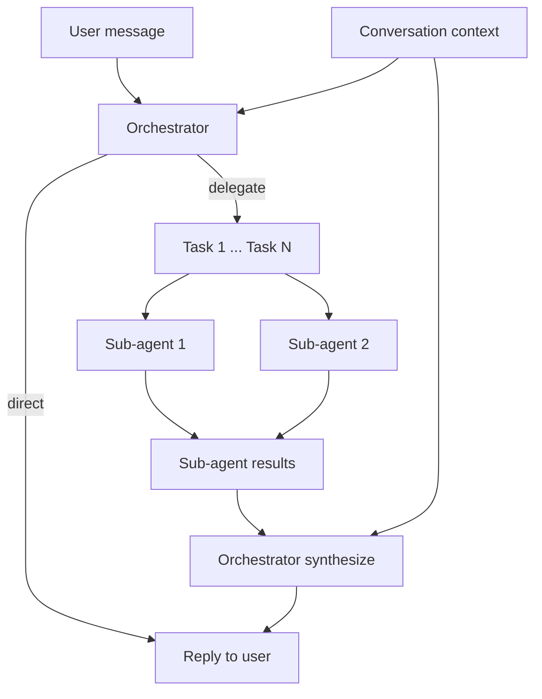

# Orchestrator-first agentic loop (replace TSA)

## Goal

Rebuild the agentic loop around a **single orchestrator with a good context window**. No TSA: no extra layer that receives context and tool lists (that duplicates context and hurts efficiency). The orchestrator plans the task, picks the best path (direct reply vs delegate), and—when delegating—sends detailed prompts to sub-agents; once all sub-agents return, the orchestrator responds to the user.

---

## Principles

- **One brain with context:** The orchestrator is the only component that sees full conversation context. It has **no tools** (no tool definitions in its context), so no context pollution from tool schemas.
- **Plan, then act:** Orchestrator decides: (1) **Direct** — task is simple, respond immediately; or (2) **Delegate** — task needs tools or research, decompose into sub-tasks and send each to a sub-agent with a detailed prompt.
- **Sub-agents do tool work:** Only sub-agents have tools (file, bash, web, browser, etc.). They receive a single, focused prompt from the orchestrator and return one result per task.
- **Orchestrator synthesizes:** After all sub-agents finish, the orchestrator gets their results and produces the final user-facing response (one more orchestrator call with context + sub-agent results).
- **Decompose, don’t complicate:** The orchestrator should break down complex tasks into clear sub-tasks and choose the simplest path that answers or fulfills the user’s request.

---

## High-level flow

1. **User message** (and conversation history) → **Orchestrator** (one LLM call, no tools, large context).
2. **Orchestrator output** (structured JSON):
  - **Direct:** `strategy: "direct"` + `response: "..."` → return that response to the user.
  - **Delegate:** `strategy: "delegate"` + `tasks: [{ prompt: "..." }, ...]` → run sub-agents with those prompts.
3. **Sub-agents:** Each task is run by the existing sub-agent (tool loop inside the tool). No TSA. Sub-agent returns a single result string per task.
4. **Synthesize:** When all sub-agents have returned, call the **orchestrator again** with: original user message, conversation context, and `sub_agent_results: [ ... ]`. Orchestrator outputs the final response text → return to user.

---

## What to remove or change

- **TSA:** Remove from the main flow. Options: (a) delete `tool_skill_agent` usage from [src/channels/telegram.rs](src/channels/telegram.rs) and from [src/tools/sub_agent.rs](src/tools/sub_agent.rs), and either remove the module or keep it behind a kill switch (config) that is off by default; (b) or remove the TSA module and config flags entirely. Plan assumes (a) then deprecate/remove in a follow-up.
- **Current “main agent with tools” loop:** Replace with the orchestrator-first flow above. The main loop in [src/channels/telegram.rs](src/channels/telegram.rs) no longer passes `tool_defs` to the main LLM; instead it calls the orchestrator, then either returns the direct response or runs sub-agents and a second orchestrator call.

---

## Orchestrator contract (detailed)

### First call (plan)

- **Input:** System prompt (orchestrator role, rules, timezone/workspace if needed) + conversation messages (recent N or summarized). **No tools.**
- **Output (structured JSON):**
  - `strategy`: `"direct"` | `"delegate"`
  - If **direct:** `response`: string (the reply to the user). Optional `summary` for logs.
  - If **delegate:** `tasks`: array of `{ "prompt": "detailed instruction for sub-agent" }`. Optional `summary` (rationale). The orchestrator must not complicate: decompose into the minimal set of clear, focused tasks that together answer or fulfill the request.

### Second call (synthesize, only when strategy was delegate)

- **Input:** Same system prompt + conversation context + a single user-style message that contains the original request and the sub-agent results (e.g. "Sub-agent results:\n1. ...\n2. ..."). **No tools.**
- **Output:** Plain text response (or structured with a single `response` field) to show to the user.

---

## Context window for the orchestrator

- **Good context window:** Pass a bounded conversation history (e.g. last K messages or a summary) so the orchestrator can plan and decompose correctly. Use existing compaction/summary logic if needed; ensure the orchestrator gets enough context (config: e.g. `orchestrator_max_context_messages` or reuse `max_session_messages` / `compact_keep_recent` for the slice passed to the orchestrator).
- **No tool definitions** in orchestrator calls, so the context is not polluted by tool schemas.

---

## Implementation outline

### 1. Orchestrator module ([src/orchestrator.rs](src/orchestrator.rs))

- Extend the existing `Plan` (or replace) with:
  - `strategy`: `Direct` | `Delegate`
  - `response`: `Option<String>` (present when strategy is Direct)
  - `tasks`: `Option<Vec<DelegateTask>>` where `DelegateTask { prompt: String }` (present when strategy is Delegate)
- Update the orchestrator system prompt to:
  - Emphasize: choose the **simplest path**; direct when a short, self-contained reply is enough; delegate only when tools or multi-step research are needed.
  - Decompose complex requests into clear sub-tasks; each task should have a detailed prompt so the sub-agent can run without further context.
- Add a **synthesize** entry point: `orchestrator_synthesize(config, system_prompt, context_messages, user_message_with_sub_agent_results) -> Result<String, _>`. This is a single LLM call (no tools) that returns the final response text.

### 2. Main loop in [src/channels/telegram.rs](src/channels/telegram.rs)

- **Replace** the current agentic tool-use loop with:
  1. Build orchestrator context (recent messages or summary; no tool_defs).
  2. Call `orchestrator::run_orchestrator_plan(config, user_message, context)` (or equivalent that returns the new Plan with optional `response` / `tasks`).
  3. If **Direct:** return `plan.response` (or the parsed response) to the user. Done.
  4. If **Delegate:**
    - For each task in `plan.tasks`, invoke the sub-agent (reuse existing `SubAgentTool` or the same logic: sub-agent loop with tools, no TSA). Run in parallel where possible (e.g. `futures::future::join_all`).
    - Collect all results (ordered).
    - Call `orchestrator_synthesize(...)` with original message + sub-agent results.
    - Return the synthesized response to the user.
- **Remove** TSA from this path: no `evaluate_tool_use` before tool execution, because the main loop no longer runs tools; only the orchestrator and sub-agents run. (Sub-agent internally can keep or drop TSA; plan recommends dropping TSA from sub_agent for simplicity.)

### 3. Sub-agent ([src/tools/sub_agent.rs](src/tools/sub_agent.rs))

- **Remove TSA** from sub-agent: no `evaluate_tool_use` before `execute_with_auth`. Sub-agent remains a tool loop that receives a task string (prompt) and returns one result.
- **Invocation:** When the main loop delegates, it should call the sub-agent logic directly (same as today’s `SubAgentTool::execute` but triggered from the telegram loop with a list of prompts), not via the main registry’s `sub_agent` tool (to avoid the main agent having tools). So the “sub-agent” is invoked programmatically from the channel loop when the orchestrator returns `Delegate` with tasks.

### 4. Config and cleanup

- **Orchestrator:** Make `orchestrator_enabled` the main switch for this flow. When true, use the orchestrator-first loop; when false, keep the old “main agent with tools” loop (optional; you may remove the old loop and always use orchestrator).
- **TSA:** Add `tool_skill_agent_enabled: false` by default and stop using TSA in the main and sub-agent paths; or remove TSA config and module.
- **Context:** Add or reuse config for orchestrator context size (e.g. number of messages or max tokens for the context passed to the orchestrator).

### 5. Edge cases

- **No sub-agents in registry for user-facing flow:** The main channel no longer exposes the full tool list to any LLM. The only “tools” are internal: run N sub-agents (each with its own tool loop). So the telegram loop does not need `state.tools.definitions()` for the orchestrator.
- **Scheduler / override_prompt:** Scheduler can still inject a message; that message becomes the user message the orchestrator sees. No change to scheduler contract.
- **Memory / persistence:** Orchestrator does not need to write memory; if memory writes are required, they can be one of the delegated tasks (“update memory with X”) or handled in a later phase. Optional: add a single “memory” or “summary” sub-agent task when the orchestrator decides to persist something.

---

## Files to touch

| Area         | File(s)                                                                                                                                                                                                         |
| ------------ | --------------------------------------------------------------------------------------------------------------------------------------------------------------------------------------------------------------- |
| Orchestrator | [src/orchestrator.rs](src/orchestrator.rs): extend Plan (response, tasks with prompts), update prompt (simplest path, decompose), add `orchestrator_synthesize`.                                                |
| Main loop    | [src/channels/telegram.rs](src/channels/telegram.rs): replace agentic tool loop with orchestrator-first flow (plan → direct or delegate → sub-agents → synthesize). Remove TSA usage.                           |
| Sub-agent    | [src/tools/sub_agent.rs](src/tools/sub_agent.rs): remove TSA; expose or reuse a function that runs one sub-agent task (prompt → result) so the channel can call it for each delegate task.                      |
| TSA          | [src/tool_skill_agent.rs](src/tool_skill_agent.rs): no longer used in main or sub-agent path; disable by default or remove. [src/config.rs](src/config.rs): `tool_skill_agent_enabled` default false or remove. |
| Config       | [src/config.rs](src/config.rs): `orchestrator_enabled` drives new flow; optional `orchestrator_max_context_messages` or reuse existing context limits.                                                          |

---

## Summary

- **Orchestrator** = single model with good context, no tools; plans (direct vs delegate) and synthesizes after sub-agent results.
- **Sub-agents** = tool-heavy workers with detailed prompts; no TSA; return one result per task.
- **TSA** = removed from the loop; no context duplication, no tool list in the orchestrator.
- **Orchestrator** decomposes tasks and finds the best path; it does not complicate the task.

