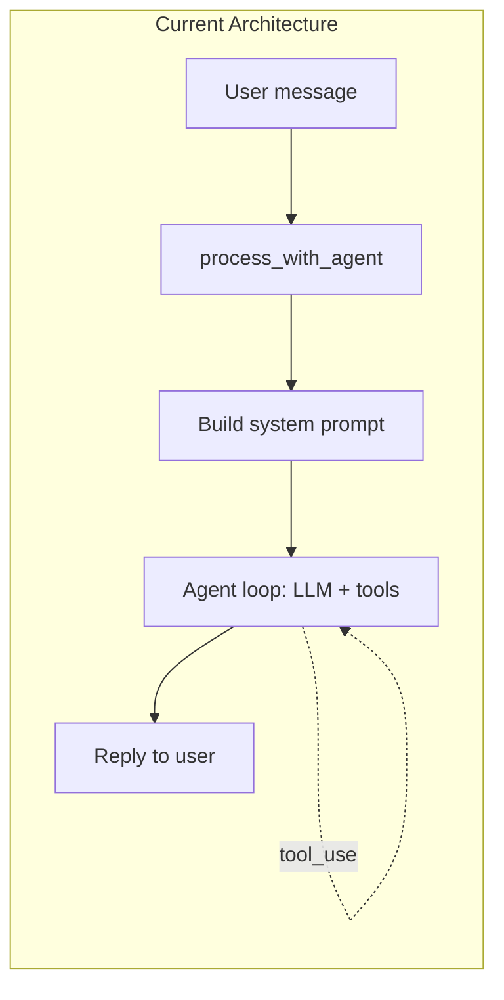
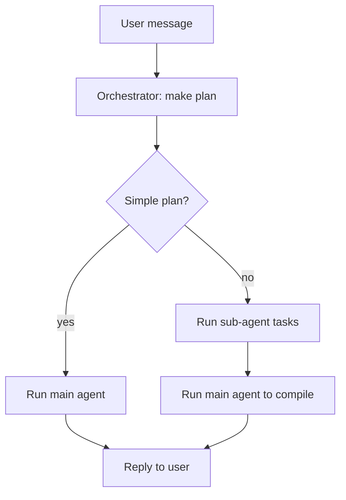

# Orchestrator Plan-First Architecture (with Persona Compatibility)

## Current Flow




Today, `process_with_agent` in [src/channels/telegram.rs](src/channels/telegram.rs) builds a system prompt (persona-scoped memory, principles, chat_id, persona_id), loads messages from session/DB (chat_id + persona_id), and runs a single agent loop. The main agent can call the `sub_agent` tool when it decides to delegate; sub-agent tools receive auth with `caller_chat_id` and `caller_persona_id` for permission checks.

## Proposed Flow




1. **Orchestrator** always produces a plan first (lightweight LLM call).
2. **Simple plans** (e.g., "hello", "what time is it") → run main agent as today; it replies directly.
3. **Complex plans** (e.g., "research X, summarize Y, compare") → run sub-agent(s) for delegated tasks, then run main agent with compiled results to synthesize the final reply.

---

## Persona Compatibility (Critical)

The current persona system scopes memory, tools, and session by `(chat_id, persona_id)`. The orchestrator architecture must preserve this.

### How Persona Is Used Today


| Component           | Persona usage                                                                                                                                                   |
| ------------------- | --------------------------------------------------------------------------------------------------------------------------------------------------------------- |
| **Memory**          | `build_memory_context(chat_id, persona_id)` loads per-persona MEMORY.md at `groups/{chat_id}/{persona_id}/MEMORY.md` and daily logs.                            |
| **System prompt**   | Injects `chat_id` and `persona_id` ("Use these when calling send_message, schedule, tiered memory...").                                                         |
| **ToolAuthContext** | `caller_chat_id`, `caller_persona_id` passed to all tool executions; memory/tiered memory tools enforce access by `(chat_id, persona_id)`.                      |
| **Session/DB**      | `load_session(chat_id, persona_id)`, `save_session`, messages all scoped by persona.                                                                            |
| **Sub-agent**       | When main agent calls `sub_agent`, auth is injected; sub-agent tools (read_tiered_memory, read_memory) use `auth_context_from_input` for persona-scoped access. |


### Orchestrator + Persona Requirements

1. **Orchestrator runs within `process_with_agent`**
  It receives `AgentRequestContext { chat_id, persona_id, caller_channel }`. No new entry points; persona resolution remains at channel level (e.g. `get_current_persona_id(chat_id)`).
2. **Orchestrator input**
  - Receives `chat_id`, `persona_id` for context (e.g. optional brief memory summary).  
  - Does not need full persona memory for planning; strategy (direct vs delegate) is based on message complexity.  
  - Optional: pass a short `memory_context` summary for persona-aware planning (e.g. "Tier 2: project X").
3. **Direct path**
  Main agent loop runs exactly as today. Uses `context.persona_id`, `context.chat_id` for memory, system prompt, and `ToolAuthContext`. No changes.
4. **Delegate path (sub-agents run by orchestrator)**
  When the orchestrator runs `SubAgentTool` directly (before main agent), it must inject `ToolAuthContext` with:
  - `caller_chat_id` = `context.chat_id`
  - `caller_persona_id` = `context.persona_id`
  - `caller_channel` = `context.caller_channel`
  - `control_chat_ids` = `state.config.control_chat_ids`
   Sub-agent tools (read_tiered_memory, read_memory, read_file, etc.) use this auth for permission checks. Without it, sub-agents cannot read this persona's memory.
5. **Compiled results + main agent**
  After sub-agents finish, inject results and run the main agent loop. The main agent uses the same persona-scoped session, memory, and tools. Final reply stays in the same persona context.
6. **Session and messages**
  Orchestrator does not load or save session. Main agent loop continues to use `load_session(chat_id, persona_id)` and `save_session(chat_id, persona_id)`. Message history remains persona-scoped.

### Code-level Checklist

- `run_orchestrator_plan(config, user_message, chat_id, persona_id, recent_context?)` — pass `chat_id`, `persona_id` for optional persona-aware planning.
- Delegate path: when invoking `SubAgentTool::execute` (or equivalent), build input with `inject_auth_context(input, &ToolAuthContext { caller_chat_id: context.chat_id, caller_persona_id: context.persona_id, ... })`.
- Main agent loop: unchanged; continues to receive `AgentRequestContext` with `persona_id` and build `tool_auth` from it.

---

## Implementation Plan

### 1. Add Orchestrator Module

Create [src/orchestrator.rs](src/orchestrator.rs) with:

- **Plan struct** (serde):

```rust
  pub struct Plan {
      pub strategy: PlanStrategy,  // Direct | Delegate
      pub summary: String,         // Brief rationale
      pub delegate_tasks: Option<Vec<String>>,  // For Delegate
  }
  pub enum PlanStrategy {
      Direct,   // Main agent handles reply
      Delegate, // Sub-agents do work, main agent compiles
  }
  

```

- `**run_orchestrator_plan(config, user_message, chat_id, persona_id, recent_context?) -> Plan**`  
One LLM call with no tools; system prompt instructs JSON output. Parse JSON into `Plan`. Optionally include a brief persona memory summary for context-aware planning.
- **Config**: `orchestrator_enabled: bool` (default `true`), optional `orchestrator_model`.

### 2. Integrate into process_with_agent

In [src/channels/telegram.rs](src/channels/telegram.rs), inside `process_with_agent_with_events`:

1. If `orchestrator_enabled`:
  - Call `run_orchestrator_plan(state.config, last_user_msg, context.chat_id, context.persona_id, recent_context?)`.
2. If `Plan.strategy == Direct`: run main agent loop as today.
3. If `Plan.strategy == Delegate` and `delegate_tasks` non-empty:
  - For each task: build tool input with `inject_auth_context(json!({ "task": t, "context": "..." }), &tool_auth)` where `tool_auth` uses `context.chat_id` and `context.persona_id`.
  - Call `SubAgentTool` (or `state.tools.execute_with_auth("sub_agent", input, &tool_auth)`).
  - Inject compiled results as context (e.g. add user message `[orchestrator] Sub-agent results:\n{results}`).
  - Run main agent loop to synthesize final reply.

**Fallback** when orchestrator is disabled or fails: run current behavior (main agent only).

### 3. Orchestrator Prompt Design

- Input: last user message, optional last 2–3 messages, optional brief persona memory summary.
- Output: JSON only, e.g. `{"strategy": "direct" | "delegate", "summary": "...", "delegate_tasks": ["task1", "task2"]}`.
- Instructions: simple greetings → `direct`; multi-step research or decomposable work → `delegate` with explicit tasks.

### 4. Config Changes

In [src/config.rs](src/config.rs): `orchestrator_enabled: bool`, `orchestrator_model: Option<String>`.

### 5. Files to Create/Modify


| File                         | Action                                                                                                                           |
| ---------------------------- | -------------------------------------------------------------------------------------------------------------------------------- |
| `src/orchestrator.rs`        | **New**: Plan struct, `run_orchestrator_plan`, persona params                                                                    |
| `src/main.rs`                | Add `mod orchestrator`                                                                                                           |
| `src/channels/telegram.rs`   | Call orchestrator before main loop; Delegate path: inject auth when running sub_agent; preserve `AgentRequestContext` throughout |
| `src/config.rs`              | Add `orchestrator_enabled`, `orchestrator_model`                                                                                 |
| `.env.example` / config YAML | Document new options                                                                                                             |


