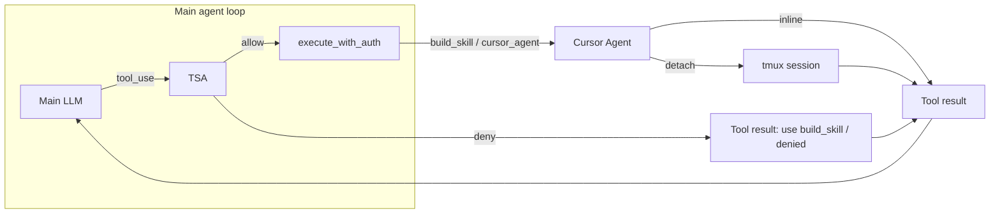

# Combined: Tool & Skill Agent + Cursor Agent Tmux

This plan merges two efforts: (1) a **Tool and Skill Agent (TSA)** that gates all tool and skill use and creation, and (2) **cursor-agent tmux spawn** for non-blocking coding tasks. It also establishes that **tool and skill creation always uses cursor_agent** (with detach when available), and TSA enforces that policy.

---

## Part 1: Tool and Skill Agent (TSA)

### Role

- **Gatekeeper**: Runs before every tool execution. Main agent still chooses tools; TSA returns Allow or Deny (with reason/suggestion). On Deny, a synthetic tool result is returned so the main agent can adapt.
- **Creation policy**: Creation (new skills, new tools-as-skills) is only allowed via the **cursor_agent path** (see Part 3). TSA **denies** direct `write_file` / `edit_file` under the skills directory; the main agent must use `build_skill` or a scoped `cursor_agent` task instead.

### Current gap

- [src/channels/telegram.rs](src/channels/telegram.rs): agent loop calls `state.tools.execute_with_auth(name, input, &tool_auth)` with no intermediate validation (except high-risk approval for bash/cursor_agent in [src/tools/mod.rs](src/tools/mod.rs)).
- Skills: catalog in prompt; model uses `activate_skill` and sometimes `write_file` for creation. No dedicated gate or creation path.

### TSA design

- **Module**: `src/tool_skill_agent.rs` (or `src/tsa.rs`).
- **Interface**: `evaluate_tool_use(tool_name, tool_input, conversation_context, auth) -> TsaDecision`.
- **TsaDecision**: `Allow` | `Deny { reason, suggestion }`.
- **Implementation**: Single LLM call with a fixed prompt (recommended for v1): given conversation + requested tool + input, respond with JSON `{ decision, reason, suggestion }`. Deny if irrelevant, redundant, unsafe, or if creation is attempted via write_file/edit_file under skills dir. Use a dedicated or cheap model (`tool_skill_agent_model` or `orchestrator_model`).
- **Config**: `tool_skill_agent_enabled: bool`, `tool_skill_agent_model: String`. Env: `TOOL_SKILL_AGENT_ENABLED`, `TOOL_SKILL_AGENT_MODEL`.

### Integration

- **Main loop**: In [src/channels/telegram.rs](src/channels/telegram.rs), in the `stop_reason == "tool_use"` branch, before `execute_with_auth`: if TSA enabled, call `tsa::evaluate_tool_use(...)`. On Allow → execute as today. On Deny → push ToolResult with TSA message, do not execute. Pass bounded context (e.g. last 2–4 messages).
- **Sub-agent**: In [src/tools/sub_agent.rs](src/tools/sub_agent.rs), before each `tools.execute_with_auth`, call the same TSA for consistency.

### Creation handling in TSA

- **sync_skills**: Gated as normal; TSA allows only when user clearly asked to add/update skills from an external source.
- **write_file / edit_file under skills dir**: TSA **denies** and suggests: "To create or change a skill, use the build_skill tool (or cursor_agent with a creation task). Do not write directly under the skills directory."
- **build_skill** (and cursor_agent): TSA allows when conversation indicates user requested creating a new tool/skill; creation then runs via cursor_agent (see Part 3).

### Observability

- Log TSA decision (allow/deny) and tool name.
- Optional: `AgentEvent::ToolSkillAgentDeny` for UI/logs.

---

## Part 2: Cursor Agent Tmux Spawn

### Goal

- **detach: true**: Spawn cursor-agent in a **tmux session** so coding tasks don’t block the bot; user can attach (`tmux attach -t <session>`) and optionally redirect via send-keys.
- **detach: false** (default): Keep current blocking behavior.

### Cursor agent tool changes

- **Input**: Add optional `detach: boolean` (default `false`).
- **When detach = true**:
  - Spawn with `tmux new-session -d -s <session_name> -c <workdir> -- <cursor_agent_cli> -p "..." [--model ...] --output-format text`.
  - Session name: configurable prefix (e.g. `microclaw-cursor`) + unique suffix (run id or timestamp). Config: `cursor_agent_tmux_session_prefix` (default `microclaw-cursor`).
  - Return immediately with message: "Spawned in tmux session `microclaw-cursor-123`. Attach: `tmux attach -t microclaw-cursor-123`. Use cursor_agent_send to redirect."
  - Insert run in DB with `tmux_session` set; list_cursor_agent_runs shows "running" / session name.
- **When detach = false**: Unchanged (block until done, then return output).

### DB

- **Migration**: Add `tmux_session TEXT` to `cursor_agent_runs`. When detach=true, set tmux_session and write run; when detach=false, tmux_session = null. list_cursor_agent_runs shows tmux_session and attach hint when present.

### cursor_agent_send tool

- **Purpose**: Send keys to a running cursor-agent tmux session to redirect mid-task.
- **Input**: `tmux_session` (or run id), `keys` (string; newline = Enter). Sanitize to printable + newline.
- **Execution**: `tmux send-keys -t <session> "<keys>" Enter`. Validate session name matches configured prefix so we don’t touch other tmux sessions.
- Register in [src/tools/mod.rs](src/tools/mod.rs).

### Docker

- **Option A (in code)**: When `detach: true`, if in Docker (e.g. env `MICROCLAW_IN_DOCKER=1` or `/.dockerenv`) or config `cursor_agent_tmux_enabled: false`, skip tmux and return: "Tmux spawn is not available in this environment. Run the bot on a host with tmux and cursor-agent, or use detach: false."
- **Option B (docs)**: Document a host-runner (HTTP spawn API) for bot-in-Docker setups that want tmux on the host.
- Config: optional `cursor_agent_tmux_enabled` to force-disable; `cursor_agent_tmux_session_prefix` for session names.

### Doctor

- Optional: [src/doctor.rs](src/doctor.rs) check that `tmux` is available when cursor_agent is configured and tmux spawn is enabled.

---

## Part 3: Creation Always via Cursor Agent

### Policy

- **Building a tool or skill** = creating or editing files under the skills directory (SKILL.md, scripts, .env in skill folder). This must **always** go through **cursor_agent** (or the wrapper `build_skill`), not through the main agent calling write_file/edit_file.
- When tmux is available, creation runs with **detach: true** so the bot responds immediately and the user can attach to watch or redirect.

### build_skill tool (recommended)

- **Purpose**: Single entry point for "create or update a skill." Ensures creation uses cursor_agent and detach when possible.
- **Input**: e.g. `name`, `description`, `instructions` (or high-level spec), optional `update_existing: bool`.
- **Behavior**: Build a prompt for cursor_agent (e.g. "Create a MicroClaw skill at {skills_dir}/{name}/ with SKILL.md containing this description and instructions; put credentials in .env in that folder. Follow the skill template..."). Call cursor_agent with that prompt and **detach: true** when tmux is available (otherwise detach: false). Return the same style of message as cursor_agent (session name + attach instructions, or inline output).
- **TSA**: Allows build_skill when the conversation clearly indicates the user asked to create or update a skill/tool. Denies direct write_file/edit_file under skills dir (see Part 1).

### System prompt / AGENTS.md

- State that **new tools and skills must be created via the build_skill tool** (or a clear cursor_agent creation task), not by writing files under the skills directory. The bot must not use write_file or edit_file to create or replace SKILL.md or skill folder contents; only cursor_agent (via build_skill) may do that.

### Flow summary

---

## Files to change (combined)

| Area         | File                                                               | Change                                                                                                        |
| ------------ | ------------------------------------------------------------------ | ------------------------------------------------------------------------------------------------------------- |
| TSA          | New `src/tool_skill_agent.rs`, [src/lib.rs](src/lib.rs)            | TSA module, evaluate_tool_use, TsaDecision; export                                                            |
| Config       | [src/config.rs](src/config.rs)                                     | tool_skill_agent_enabled, tool_skill_agent_model; cursor_agent_tmux_session_prefix, cursor_agent_tmux_enabled |
| Main loop    | [src/channels/telegram.rs](src/channels/telegram.rs)               | Call TSA before execute_with_auth; bounded context                                                            |
| Sub-agent    | [src/tools/sub_agent.rs](src/tools/sub_agent.rs)                   | Call TSA before execute_with_auth                                                                             |
| DB           | [src/db.rs](src/db.rs)                                             | Add tmux_session to cursor_agent_runs; migration                                                              |
| Cursor agent | [src/tools/cursor_agent.rs](src/tools/cursor_agent.rs)             | detach input; tmux spawn when detach=true and tmux enabled; Docker check                                      |
| New tools    | [src/tools/cursor_agent.rs](src/tools/cursor_agent.rs) or new file | cursor_agent_send; build_skill (calls cursor_agent with creation prompt, detach when possible)                |
| Registry     | [src/tools/mod.rs](src/tools/mod.rs)                               | Register cursor_agent_send, build_skill                                                                       |
| Doctor       | [src/doctor.rs](src/doctor.rs)                                     | Optional tmux check when cursor_agent + tmux enabled                                                          |
| Env / wizard | [.env.example](.env.example), config wizard                        | New env vars and defaults                                                                                     |
| Docs         | [ARCHITECTURE.md](ARCHITECTURE.md)                                 | TSA subsection; creation-via-cursor-agent and tmux spawn                                                      |

---

## Backward compatibility

- TSA: Config default for `tool_skill_agent_enabled` (e.g. true or false per your preference); when false, no TSA calls.
- cursor_agent: Default `detach: false`; existing callers unchanged. list_cursor_agent_runs extended to show tmux_session and attach hint.
- Creation: After rollout, main agent is instructed to use build_skill; TSA denies direct skills-dir writes so behavior converges without breaking existing sync_skills or read-only use.

---

## Out of scope (later)

- Auto-detect tmux session end and notify (phase 2).
- Git worktrees per task.
- Host-runner implementation for Docker (document API only).
- Optional rule-based TSA layer (allow/deny lists, rate limits) before or instead of LLM for cost/latency.

