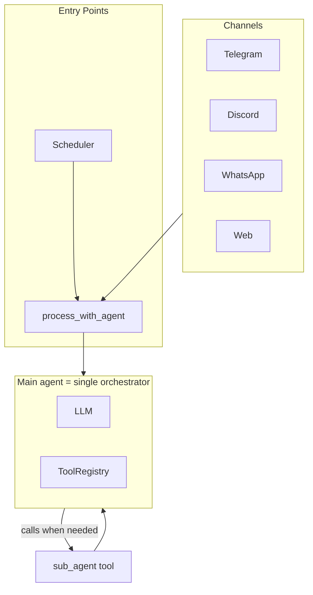
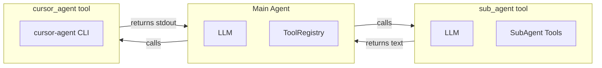

# MicroClaw Architecture

This document describes the core architecture of MicroClaw: the agentic loop, tool system, skills, sub-agents, and how they connect.

See also: [CLAUDE.md](CLAUDE.md) (overview and quick reference), [DEVELOP.md](DEVELOP.md) (development guide), [DOCKER.md](DOCKER.md) (deployment).

---

## High-Level Data Flow

---

## 1. Agentic Loop and Tool Use

### Entry Point

The central entry point is `process_with_agent` (and `process_with_agent_with_events`) in `src/channels/telegram.rs`. Each channel **resolves** its handle to a canonical `chat_id` (see [§6 Unified Contact](#6-unified-contact-linked-identity-and-channel-bindings)) before calling it. It is called by:

- **Telegram** — message handler
- **Discord** — message handler
- **WhatsApp** — webhook handler
- **Web** — HTTP API handlers
- **Scheduler** — background task executor (every 60s for due cron tasks)

### Agent Loop Flow

The main chat agent is the single orchestrator: it decides when to reply directly and when to call tools (including `sub_agent` for delegation). There is no separate plan-first layer.

1. **Load session / history** from SQLite (`sessions`, `messages`). Only a **bounded recent window** is sent to the LLM: when the session exceeds `max_session_messages` (default 40), older messages are summarized and the last `compact_keep_recent` (default 20) are kept verbatim. So we do not stuff long history into context; the rest is retrieved on demand via **search_chat_history** (past messages) and **search_vault** (ORIGIN vault). The system prompt guarantees "at least 2 from you and 2 from the user" for coherence; the actual window is configurable.
2. **Build system prompt** from principles (AGENTS.md), memory (MEMORY.md), skills catalog, and tool list.
3. **Main agent loop** (up to `max_tool_iterations`):
   - Call LLM via `state.llm.send_message(system_prompt, messages, Some(tool_defs))`.
   - Parse **stop_reason** from the response (see [Stop reason](#stop-reason) below):
     - `end_turn` or `max_tokens` → extract text, save session, return response.
     - `tool_use` → for each `ResponseContentBlock::ToolUse`, call `tools.execute_with_auth(name, input, tool_auth)`, append `ContentBlock::ToolResult` to messages, continue loop.
4. **Timeouts**: LLM round 180s, tool execution 120s.

### Stop Reason

`stop_reason` is **not** sent to the LLM; it is a **response field** from the provider indicating why the model stopped. The code normalizes provider-specific values to:

| Normalized  | Meaning / raw variants |
|------------|-------------------------|
| `end_turn` | Model finished; raw: `stop`, `end_turn`, or missing |
| `tool_use` | Model requested tool calls; raw: `tool_use`, `tool_calls` |
| `max_tokens` | Hit token limit; raw: `max_tokens`, `length` |

The agent loop branches only on these three; any other value is treated like a finished turn.

### Tool Registry and Execution

- **Registry**: `src/tools/mod.rs` — `ToolRegistry` holds `Vec<Box<dyn Tool>>`.
- **Tool trait**: `name()`, `definition()`, `execute(input) -> ToolResult`.
- **Definitions**: `ToolDefinition` (name, description, input_schema) is sent to the LLM API so the model can choose tools.
- **Auth injection**: `execute_with_auth` injects `__microclaw_auth` into the tool input (`caller_channel`, `caller_chat_id`, `caller_persona_id`, `control_chat_ids`).
- **Tool and Skill Agent (TSA)**: When `tool_skill_agent_enabled` is true, every tool use is gated by `tool_skill_agent::evaluate_tool_use()` before execution. TSA can allow or deny (with reason/suggestion). Direct `write_file`/`edit_file` under the skills directory is always denied; creation must go through `build_skill` or `cursor_agent`.

### Cursor agent and skill creation

- **cursor_agent** supports `detach: true`: spawns cursor-agent in a tmux session and returns immediately. Session name uses `cursor_agent_tmux_session_prefix` + timestamp. Not available in Docker (or when `cursor_agent_tmux_enabled` is false). When `CURSOR_AGENT_RUNNER_URL` is set (e.g. Docker), the bot POSTs spawn requests to the host runner instead of running locally.
- **cursor_agent_send**: sends keys to a running cursor-agent tmux session (session name must match the configured prefix).
- **build_skill**: creates or updates a skill by running cursor-agent with a creation prompt; uses `detach: true` when tmux is available. Use this instead of writing files under the skills directory.

### Main vs Sub-Agent Tools

| Main agent | Sub-agent |
|------------|-----------|
| bash, browser, read/write/edit file, glob, grep | bash, browser, read/write/edit file, glob, grep |
| read/write memory, web_fetch, web_search | read_memory, web_fetch, web_search |
| send_message, schedule_*, export_chat | *(none)* |
| sub_agent, cursor_agent, cursor_agent_send, build_skill, activate_skill, sync_skills | *(none)* |
| tiered_memory, search_history, search_vault | search_history |
| MCP tools | *(none)* |

Sub-agent registry: `ToolRegistry::new_sub_agent()` — restricted set; no send/schedule/memory-write/MCP.

---

## 2. Orchestration (main agent only)

The main chat agent is the orchestrator. It has access to the `sub_agent` tool and chooses when to delegate: no separate plan-first LLM step. Delegation is driven by the same agent loop (tool_use → execute sub_agent → tool result → continue). Legacy config `ORCHESTRATOR_ENABLED` exists but defaults to `false`; the plan-first orchestrator code path is no longer used.

---

## 3. Skills System

### Purpose

Skills are extensible instruction sets the LLM can load on demand. They are **on-demand instructions** (Markdown), not new tools in the registry.

### Structure

- **Location**: `workspace/skills/<name>/` and `workspace/shared/skills/<name>/`.
- **Entry file**: `SKILL.md` or `skill.md` with YAML frontmatter.
- **Frontmatter**: `name`, `description`, `platforms`, `deps`, `source`, `version`, `updated_at`.
- **Body**: Markdown instructions the agent follows after loading.

### Flow

1. **Discovery**: `SkillManager::discover_skills()` scans dirs, parses frontmatter, filters by platform/deps.
2. **Catalog in prompt**: `skills.build_skills_catalog()` produces `<available_skills>…</available_skills>` injected into the system prompt.
3. **Activation**: The LLM calls the `activate_skill` tool with `skill_name`; the tool loads the full `SKILL.md` and returns metadata + instructions.
4. **Usage**: The LLM uses the returned instructions to perform the task (e.g. API calls via bash, file ops).

### Key Files

- `src/skills.rs` — `SkillManager`, `SkillMetadata`, discovery, platform/dep checks.
- `src/tools/activate_skill.rs` — `ActivateSkillTool` loads and returns skill content.
- `src/tools/sync_skills.rs` — sync skills from external sources.

---

## 4. Sub-Agents

### Two Invocation Paths

**A) Sub-agent tool (LLM-driven)**  
The main agent calls the `sub_agent` tool with `task` and optional `context`. `src/tools/sub_agent.rs` runs a full agent loop inside the tool:

- Creates a fresh LLM provider and `ToolRegistry::new_sub_agent()`.
- Builds messages: `[{ role: "user", content: "Context: …\n\nTask: …" }]`.
- Runs its own loop (up to 10 iterations) with the sub-agent tool set.
- Returns the final text as the tool result to the main agent.

**B) Legacy orchestrator path (disabled)**  
The former plan-first orchestrator could run sub-agents before the main agent and inject results; that path is no longer used. Delegation is only via (A).

### Sub-Agent Characteristics

- **Isolated context**: No access to main chat; only `task` and `context`.
- **Limited tools**: bash, browser, file ops, glob, grep, read_memory, web_fetch, web_search, search_history.
- **Auth propagation**: Caller’s auth context is passed through to sub-agent tool calls when present.
- **Iteration cap**: 10 iterations per sub-agent.
- **Single return**: Final text is the tool result; no streaming or mid-task updates.

### cursor_agent (External CLI)

The `cursor_agent` tool runs the Cursor CLI (`cursor-agent`) as a subprocess. It does not run an LLM loop; it executes the CLI and returns stdout/stderr. Runs are logged for `list_cursor_agent_runs`.

---

## 5. MCP Integration

- MCP tools are wrapped as `McpTool` in `src/tools/mcp.rs`.
- Qualified names: `mcp_{server}_{tool}` (sanitized for the LLM API).
- They are added dynamically to `ToolRegistry` from `McpManager`; only the main agent sees them, not sub-agents.

---

## 6. Unified Contact (Linked Identity) and Channel Bindings

Chat is **one conversation per contact**, synced across channels. A **contact** is identified by a **canonical `chat_id`**. Channel handles (Telegram chat id, Discord channel id, web session key) are bound to that contact via the **`channel_bindings`** table.

### Resolve flow

Every entry path (Telegram, Discord, Web, Scheduler) **resolves** `(channel_type, channel_handle)` to a canonical `chat_id` **before** building `AgentRequestContext` and calling `process_with_agent`:

- **Telegram**: `(telegram, chat_id)` → lookup or create binding; canonical is that chat_id (or existing linked contact).
- **Discord**: `(discord, channel_id)` → same pattern.
- **Web**: `(web, session_key)` → resolve via bindings; if missing, create new contact (e.g. hash-based id) and insert binding.
- **Scheduler**: uses canonical `chat_id` already stored on the task.

DB helpers: `resolve_canonical_chat_id(channel_type, channel_handle, create_with_canonical_id)`, `link_channel(canonical_chat_id, channel_type, channel_handle)`, `unlink_channel`, `list_bindings_for_contact`. Messages and sessions are keyed by `(chat_id, persona_id)` where `chat_id` is always the canonical one.

### Delivery (sync across channels)

After the agent produces a reply, the handler does **not** store and send only to the requesting channel. It calls **`deliver_to_contact(state, canonical_chat_id, persona_id, text)`** (in `src/channel.rs`), which:

1. **Stores the message once** in the DB under the canonical `chat_id`.
2. **Delivers to every bound channel**: Telegram (via `Bot`), Discord (via optional `discord_http` on `AppState`), web (history is loaded by clients; no extra push unless SSE is added).

So the same thread is visible on all linked channels; new bot replies are sent to all bindings so the conversation stays in sync.

### Web identity and linking

Web has no native identity. To sync with Telegram/Discord, the user **binds** the web session to an existing contact (e.g. “Link to contact” in the UI), which adds a `(web, session_key)` binding to that contact’s canonical `chat_id`. After that, web and Telegram/Discord share the same contact and history. **Unlink** removes the web binding so that session becomes a separate contact again.

---

## 7. Shared State (AppState)

`AppState` (Arc-wrapped) holds:

- `config`, `db`, `llm`, `tools`, `memory`, `skills`, `scheduler`, `mcp_manager`
- `bot` (Telegram `Bot`) for sending to Telegram
- `discord_http` (optional `Arc<serenity::http::Http>`) for sending to Discord from non-Discord code (e.g. when a reply is delivered to all bound channels)

It is passed into `process_with_agent` and used throughout the loop. Delivery to all channels uses `deliver_to_contact`, which reads `bot` and `discord_http` from state.

---

## Summary Diagram

