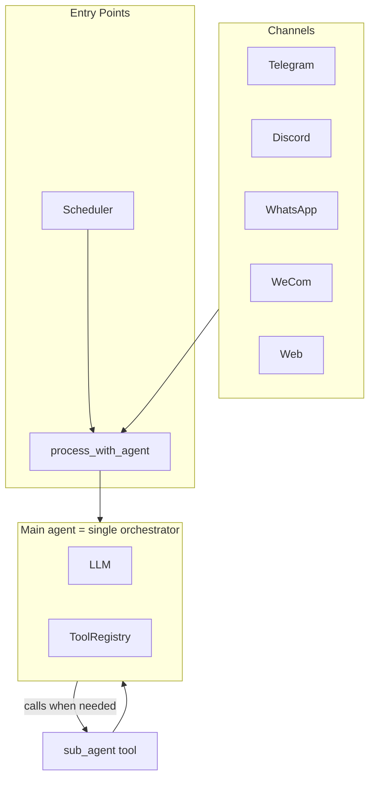
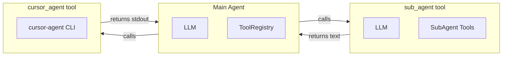

# FinallyAValueBot Architecture

This document describes the core architecture of FinallyAValueBot: the agentic loop, tool system, skills, sub-agents, and how they connect.

See also: [CLAUDE.md](CLAUDE.md) (overview and quick reference), [DEVELOP.md](DEVELOP.md) (development guide), [DOCKER.md.bak](DOCKER.md.bak) (archived legacy deployment notes).

---

## High-Level Data Flow

```mermaid
flowchart TB
    subgraph Channels [Channels]
        Telegram
        Discord
        WhatsApp
        WeCom
        Web
    end

    subgraph Entry [Entry Points]
        process_with_agent
        Scheduler
    end

    subgraph MainAgent [Main agent = single orchestrator]
        LLM
        ToolRegistry
    end

    Channels --> process_with_agent
    Scheduler --> process_with_agent
    process_with_agent --> MainAgent
    MainAgent -->|calls when needed| SubAgent[sub_agent tool]
    SubAgent --> MainAgent
```

---

## 1. Agentic Loop and Tool Use

### Entry Point

The central entry point is `process_with_agent` (and `process_with_agent_with_events`) in `src/channels/telegram.rs`. Each channel **resolves** its handle to a canonical `chat_id` (see [§6 Unified Contact](#6-unified-contact-linked-identity-and-channel-bindings)) before calling it. It is called by:

- **Telegram** — message handler
- **Discord** — message handler
- **WhatsApp** — webhook handler
- **WeCom** — 智能机器人 WebSocket long connection (preferred) or encrypted self-built app callback
- **Web** — HTTP API handlers
- **Scheduler** — background task executor (every 60s for due cron tasks)

### Agent Loop Flow

Three engines are selectable in Settings → Runtime (`AGENT_ENGINE` in `app_settings`, default `classic`):

- **Classic** — heuristic tool loop with optional Plan/Execute/Synthesize multi-model phases (`advance_phase` in `src/multimodel.rs`).
- **Deterministic** — structured pipeline in `src/agent_pipeline/`: cloud intent JSON → clarification gate → vault SOP or ephemeral plan → per-step local execution (retry + cloud escalation) → cloud synthesis → shared PDQE delivery. Dispatched from `process_with_agent_with_events` when `runtime_toggles.agent_engine()` is `Deterministic`. Shared bootstrap: `prepare_agent_run` in `src/channels/agent_run_prep.rs`.
- **Cursor** — delegates the full turn to a local **Cursor SDK sidecar** (`scripts/cursor-sdk-runner.py`), **auto-started on bot boot** on native installs (`CURSOR_SDK_AUTO_START`, default true). Rust flattens `prepare_agent_run` context into a prompt, streams assistant text from NDJSON, persists resume `agent_id` in `cursor_engine_agents`, and finishes via `pipeline_finish_turn`. Falls back to Classic when the sidecar is unreachable. Requires `CURSOR_API_KEY` in repo-root `.env` (passed to sidecar subprocess; not stored in SQLite).

The main chat agent is the single orchestrator: it decides when to reply directly and when to call tools (including `sub_agent` for delegation). There is no separate plan-first layer.

1. **Load session / history** from SQLite (`sessions`, `messages`). Only a **bounded recent window** is sent to the LLM: when the session exceeds `max_session_messages` (default 40), older messages are summarized and the last `compact_keep_recent` (default 20) are kept verbatim. So we do not stuff long history into context; the rest is retrieved on demand via **search_chat_history** (past messages) and **search_vault** (ORIGIN vault). The system prompt guarantees "at least 2 from you and 2 from the user" for coherence; the actual window is configurable.
2. **Build system prompt** from principles (AGENTS.md), memory (MEMORY.md), skills catalog, and tool list.
3. **Main agent loop** (up to `max_tool_iterations`):
   - Call LLM via `state.llm.send_message(system_prompt, messages, Some(tool_defs))`.
   - Parse **stop_reason** from the response (see [Stop reason](#stop-reason) below):
     - `end_turn`, `max_tokens`, or derived `ask_clarification` → extract text, save session, return response (see below).
     - `tool_use` → for each `ResponseContentBlock::ToolUse`, call `tools.execute_with_auth(name, input, tool_auth)`, append `ContentBlock::ToolResult` to messages, continue loop.
4. **Timeouts**: LLM round 180s, tool execution 120s.

### Standard Operating Procedures (vault)

Operating procedures live as markdown in the ORIGIN vault (e.g. `ORIGIN/Operations/SOPs/`). The agent loads them via `search_vault` / `read_file` and executes with skills (`run_skill_script`). See [`docs/sops.md`](docs/sops.md). Deterministic YAML workflows (`run_workflow`) and SQLite learned workflows were removed.

### Stop Reason

`stop_reason` is **not** sent to the LLM; it is a **response field** from the provider indicating why the model stopped. The code normalizes provider-specific values to:

| Normalized  | Meaning / raw variants |
|------------|-------------------------|
| `end_turn` | Model finished; raw: `stop`, `end_turn`, or missing |
| `tool_use` | Model requested tool calls; raw: `tool_use`, `tool_calls` |
| `max_tokens` | Hit token limit; raw: `max_tokens`, `length` |
| `ask_clarification` | Derived when `end_turn`/`max_tokens` text genuinely asks the user (questions, “which do you prefer”, etc.); skips deferred-commitment nudge and pre-delivery PDQE |

The agent loop branches on these; any other value is treated like a finished turn.

### Pre-delivery quality evaluation (PDQE)

Before the user sees a reply, an optional synchronous gate may run inside the shared agent loop (`RESPONSE_QUALITY_EVALUATOR_ENABLED`, Perplexity via `PERPLEXITY_API_KEY`). It judges the candidate final text against the session goal in `[current_request]` (`src/agent_turn_context.rs`). On **fail** with sufficient confidence and retries remaining (`quality_eval_max_nudges_per_run`), the loop injects `[quality_eval_feedback]` and continues without emitting `FinalResponse` or delivering. When retries are exhausted or the evaluator errors, the last candidate is delivered anyway (fail-open). `AgentEvent::FinalResponse` and channel delivery happen only after pass, skip, or exhausted budget. Implementation: `src/response_quality_evaluator.rs`, `finish_turn_with_quality_gate` in `src/channels/telegram.rs`. The **post-tool evaluator** (PTE) uses the same Perplexity sidecar and session-goal framing between tool rounds (`src/post_tool_evaluator.rs`).

The main agent no longer exposes a `send_message` tool; user-visible output is the final assistant message, with local file paths materialized at delivery (web `materialize_response_file_links`, Telegram workspace auto-images via `send_response_result`).

### Tool Registry and Execution

- **Registry**: `src/tools/mod.rs` — `ToolRegistry` holds `Vec<Box<dyn Tool>>`.
- **Tool trait**: `name()`, `definition()`, `execute(input) -> ToolResult`.
- **Definitions**: `ToolDefinition` (name, description, input_schema) is sent to the LLM API so the model can choose tools.
- **Auth injection**: `execute_with_auth` injects `__finally-a-value-bot_auth` into the tool input (`caller_channel`, `caller_chat_id`, `caller_persona_id`, `control_chat_ids`).
- **Tool and Skill Agent (TSA)**: When `tool_skill_agent_enabled` is true, every tool use is gated by `tool_skill_agent::evaluate_tool_use()` before execution. TSA can allow or deny (with reason/suggestion). Direct `write_file`/`edit_file` under the skills directory is always denied; creation must go through `build_skill` or `cursor_agent`.

### Cursor agent and skill creation

- **cursor_agent** supports `detach: true`: spawns cursor-agent in a tmux session and returns immediately. Session name uses `cursor_agent_tmux_session_prefix` + timestamp. Not available in Docker (or when `cursor_agent_tmux_enabled` is false). When `CURSOR_AGENT_RUNNER_URL` is set (e.g. Docker), the bot POSTs spawn requests to the host runner instead of running locally.
- **cursor_agent_send**: sends keys to a running cursor-agent tmux session (session name must match the configured prefix).
- **build_skill**: creates or updates a skill by running cursor-agent with a creation prompt; uses `detach: true` when tmux is available. Use this instead of writing files under the skills directory.

### Background execution

- **Agent background jobs** (`background_jobs` table, `job_kind=agent`): enqueued via web/scheduler handoff (`##BACKGROUND_JOB_HANDOFF##`); worker runs `process_with_agent_with_events` in a Tokio task; final reply via `deliver_agent_final_to_contact`.
- **Shell background jobs** (`job_kind=shell`): core tool `spawn_background_command` runs the command in tmux (`background_shell_tmux_session_prefix`), logs under `runtime/background_jobs/{job_id}/`, and a monitor loop finalizes when the session ends and delivers results to the user. On success (default), an agent background job summarizes outputs; on failure, an agent job may diagnose and retry. Not available in Docker when tmux is disabled.
- **Tracked external jobs** (`job_kind=tracked`): core tool `register_tracked_job` inserts the external system's id (e.g. ComfyUI `prompt_id`) into `background_jobs` so the cockpit queue matches user-visible job ids; does not count toward the one active shell/handoff slot per chat.
- **Foreground agent queue** (`ChatRunQueue`): one FIFO worker per `(canonical chat_id, persona_id)` so different personas in the same contact can run agent turns in parallel; the same persona stays strictly serialized. Telegram, Discord, WhatsApp, WeCom, web send, and scheduler due tasks all enqueue into this queue.
- **Ops visibility**: `GET /api/queue_diagnostics` returns one lane row per `(chat_id, persona_id)` plus `background_by_chat`; `GET /api/background_jobs` lists job rows with heartbeats.

### Main vs Sub-Agent Tools

| Main agent | Sub-agent |
|------------|-----------|
| bash, read/write/edit file, glob, grep, skills (e.g. steel-browser) | bash, read/write/edit file, glob, grep |
| read/write memory, web_fetch, web_search | read_memory, web_fetch, web_search |
| send_message, schedule_*, export_chat | *(none)* |
| sub_agent, cursor_agent, cursor_agent_send, build_skill, activate_skill, sync_skills, spawn_background_command, register_tracked_job | *(none)* |
| tiered_memory, search_history, search_vault | search_history |
| MCP tools | *(none)* |

Sub-agent registry: `ToolRegistry::new_sub_agent()` — restricted set; no send/schedule/memory-write/MCP.

---

## 2. Orchestration (main agent only)

The main chat agent is the orchestrator. It has access to the `sub_agent` tool and chooses when to delegate: no separate plan-first LLM step. Delegation is driven by the same agent loop (tool_use → execute sub_agent → tool result → continue). Legacy config `ORCHESTRATOR_ENABLED` exists but defaults to `false`; the plan-first orchestrator code path is no longer used.

---

## 3. Skills System

### Purpose

Skills are extensible instruction sets the LLM can load on demand. They are **on-demand instructions** (Markdown), not new tools in the registry.

### Structure

- **Location**: `workspace/skills/<name>/` and `workspace/shared/skills/<name>/`.
- **Entry file**: `SKILL.md` or `skill.md` with YAML frontmatter.
- **Frontmatter**: `name`, `description`, `when_to_use` (routing for the catalog), `platforms`, `deps`, `source`, `version`, `updated_at`, etc.
- **Body**: Markdown instructions the agent follows **after** `activate_skill` loads the file (not injected into the catalog).

### Flow

1. **Discovery**: `SkillManager::discover_skills()` scans dirs, parses frontmatter, filters by platform/deps.
2. **Catalog in prompt**: `skills.build_skills_catalog()` produces `<available_skills>…</available_skills>` from **YAML only** (description, `when_to_use`, compact meta). No SKILL.md body text.
3. **Activation**: The LLM calls the `activate_skill` tool with `skill_name`; the tool loads the full `SKILL.md` and returns metadata + instructions body.
4. **Usage**: The LLM uses the returned instructions to perform the task (e.g. API calls via bash, file ops).

### Key Files

- `src/skills.rs` — `SkillManager`, `SkillMetadata`, discovery, platform/dep checks.
- `src/tools/activate_skill.rs` — `ActivateSkillTool` loads and returns skill content.
- `src/tools/sync_skills.rs` — sync skills from external sources.

---

## 4. Sub-Agents

### Two Invocation Paths

**A) Sub-agent tool (LLM-driven)**  
The main agent calls the `sub_agent` tool with `task` and optional `context`. `src/tools/sub_agent.rs` runs a full agent loop inside the tool:

- Creates a fresh LLM provider and `ToolRegistry::new_sub_agent()`.
- Builds messages: `[{ role: "user", content: "Context: …\n\nTask: …" }]`.
- Runs its own loop (up to 10 iterations) with the sub-agent tool set.
- Returns the final text as the tool result to the main agent.

**B) Legacy orchestrator path (disabled)**  
The former plan-first orchestrator could run sub-agents before the main agent and inject results; that path is no longer used. Delegation is only via (A).

### Sub-Agent Characteristics

- **Isolated context**: No access to main chat; only `task` and `context`.
- **Limited tools**: bash, file ops, glob, grep, read_memory, web_fetch, web_search, search_history, skills (e.g. steel-browser).
- **Auth propagation**: Caller’s auth context is passed through to sub-agent tool calls when present.
- **Iteration cap**: 10 iterations per sub-agent.
- **Single return**: Final text is the tool result; no streaming or mid-task updates.

### cursor_agent (External CLI)

The `cursor_agent` tool runs the Cursor CLI (`cursor-agent`) as a subprocess. It does not run an LLM loop; it executes the CLI and returns stdout/stderr. Runs are logged for `list_cursor_agent_runs`.

---

## 5. MCP Integration

- MCP tools are wrapped as `McpTool` in `src/tools/mcp.rs`.
- Qualified names: `mcp_{server}_{tool}` (sanitized for the LLM API).
- They are added dynamically to `ToolRegistry` from `McpManager`; only the main agent sees them, not sub-agents.

---

## 6. Unified Contact (Linked Identity) and Channel Bindings

Chat is **one conversation per contact** in the web UI. A **contact** is identified by a **canonical `chat_id`**. Channel handles (Telegram chat id, Discord channel id, WeCom `user:`/`chat:` handle, web session key) are bound to that contact via the **`channel_bindings`** table. Outbound replies are **directional**: each external channel only receives responses to messages it sent; the web UI loads the merged history from SQLite.

### Resolve flow

Every entry path (Telegram, Discord, WeCom, Web, Scheduler) **resolves** `(channel_type, channel_handle)` to a canonical `chat_id` **before** building `AgentRequestContext` and calling `process_with_agent`:

- **Telegram**: `(telegram, chat_id)` → lookup or create binding; canonical is that chat_id (or existing linked contact).
- **Discord**: `(discord, channel_id)` → same pattern.
- **WeCom**: `(wecom, user:{userid}` or `chat:{chatid})` → string handles, all bound to the operator inbox for persona policy and web history. Inbound is either `wss://openws.work.weixin.qq.com` (`aibot_msg_callback`) or the self-built app HTTPS `/callback`. Replies are directional per handle (`DeliveryScope::platform_reply`).
- **Web**: `(web, session_key)` → resolve via bindings; if missing, create new contact (e.g. hash-based id) and insert binding.
- **Scheduler**: uses canonical `chat_id` already stored on the task.

DB helpers: `resolve_canonical_chat_id(channel_type, channel_handle, create_with_canonical_id)`, `link_channel(canonical_chat_id, channel_type, channel_handle)`, `unlink_channel`, `list_bindings_for_contact`. Messages and sessions are keyed by `(chat_id, persona_id)` where `chat_id` is always the canonical one.

Per-channel persona scope is stored in `channel_persona_policy`:

- `mode=all` (default): channel can use all personas (current behavior).
- `mode=single`: channel is locked to one persona id; inbound routing forces that persona, and cross-channel delivery skips that channel for other personas.

### Delivery (directional reply; web aggregates history)

After the agent produces a reply, handlers call **`deliver_to_contact`** (in `src/channel.rs`), which:

1. **Stores the message once** in the DB under the canonical `chat_id` (visible in the web UI).
2. **Delivers externally only per scope:**
   - **Inbound channel reply** (`DeliveryScope::platform_reply`): Telegram, Discord, WhatsApp, and WeCom replies go back only to the binding handle that received the message (WeCom groups each get their own handle).
   - **Web UI** (`DeliveryScope::StoreOnly`): main chat and focused sessions persist to history without fan-out to external channels.
   - **Scheduler / background jobs** (`StoreOnly`): results appear in the web UI; they do not broadcast to every bound channel.

So the web UI shows the unified timeline; external channels only receive replies for messages they sent.

### Web identity and linking

Web has no native identity. To sync with Telegram/Discord, the user **binds** the web session to an existing contact (e.g. “Link to contact” in the UI), which adds a `(web, session_key)` binding to that contact’s canonical `chat_id`. After that, web and Telegram/Discord share the same contact and history. **Unlink** removes the web binding so that session becomes a separate contact again.

---

## 7. Shared State (AppState)

`AppState` (Arc-wrapped) holds:

- `config`, `db`, `llm`, `tools`, `memory`, `skills`, `mcp` (via tools), `chat_queue`
- `telegram_bots`: `HashMap<i64, Bot>` — one Telegram `Bot` per `channel_bot_instances` row (platform `telegram`)
- `discord_http`: `HashMap<i64, Arc<Http>>` — one Discord HTTP client per `channel_bot_instances` row (platform `discord`)
- `wecom`: optional `WecomGateway` for the primary WeCom instance (id 4) — AI Bot WebSocket or self-built app callback

It is passed into `process_with_agent` and used throughout the loop. Delivery to all channels uses `deliver_to_contact`, which picks the correct `Bot` / Discord client / WeCom client per binding’s `bot_instance_id`.

## 8. Configuration and settings

- **Bootstrap** (`WEB_*`, `WORKSPACE_DIR`, LLM API keys, vault, social OAuth) comes from repo-root `.env` (or `FINALLY_A_VALUE_BOT_CONFIG`) plus process environment — see `Config::load` / `load_from_env` in `src/config.rs`.
- **Chat integrations** (Telegram / Discord / WhatsApp / WeCom tokens and platform access settings) are configured in **Web UI → Settings → Integrations** and persisted in SQLite. `channel_bot_instances` is the source of truth for per-bot settings such as Telegram `BOT_USERNAME` / group allowlist, Discord channel allowlist, WhatsApp phone/verify/webhook fields, and WeCom AI Bot Bot ID + secret (or self-built app corp/agent/callback/EncodingAESKey/port); `CONTROL_CHAT_IDS` remains a global `app_settings` value. First boot may one-time-import legacy channel env vars; afterward the DB is authoritative. **Restart** after token changes so dispatchers reload.
- **Channel persona routing** is configured separately in **Settings → Channels** via `channel_persona_policy`. Telegram, Discord, and WeCom instances can use all personas or a single persona for a contact. WhatsApp is intentionally single-persona because this gateway supports one WhatsApp Business number/webhook. Preferred WeCom path is 智能机器人 **长连接** (Bot ID + Secret; no public callback). Self-built app HTTPS `/callback` (port 8081 by default) remains available. Groups: AI Bot already requires @mention; callback mode only runs the agent when the app is @mentioned.
- LLM provider/model selection, runtime toggles, Cursor engine, and local-delegate settings also live in `app_settings` and are merged at startup / hot-reloaded where supported. `PATCH /api/settings` remains disabled (501); use dedicated Settings APIs.
- **Restart hook:** set `FINALLY_A_VALUE_BOT_RESTART_COMMAND` to a fixed supervisor command; authenticated `POST /api/restart` runs it (optional one-click from Web UI).

### Universal chat id (`997894126` / `UNIVERSAL_CHAT_ID`)

Web resolves a single canonical `chat_id` (default placeholder `997894126` or `UNIVERSAL_CHAT_ID`). When `UNIVERSAL_CHAT_ID` is set, external channels can bind to that same contact for a unified inbox. **Future work:** multiple selectable contacts / sessions in web and clearer separation from “one magic id” defaults — see development journal.

---

## Summary Diagram

```mermaid
flowchart LR
    subgraph MainAgent [Main Agent]
        LLM1[LLM]
        Tools1[ToolRegistry]
    end

    subgraph SubAgentTool [sub_agent tool]
        LLM2[LLM]
        Tools2[SubAgent Tools]
    end

    subgraph CursorAgent [cursor_agent tool]
        CLI[cursor-agent CLI]
    end

    MainAgent -->|calls| SubAgentTool
    MainAgent -->|calls| CursorAgent
    SubAgentTool -->|returns text| MainAgent
    CursorAgent -->|returns stdout| MainAgent
```
