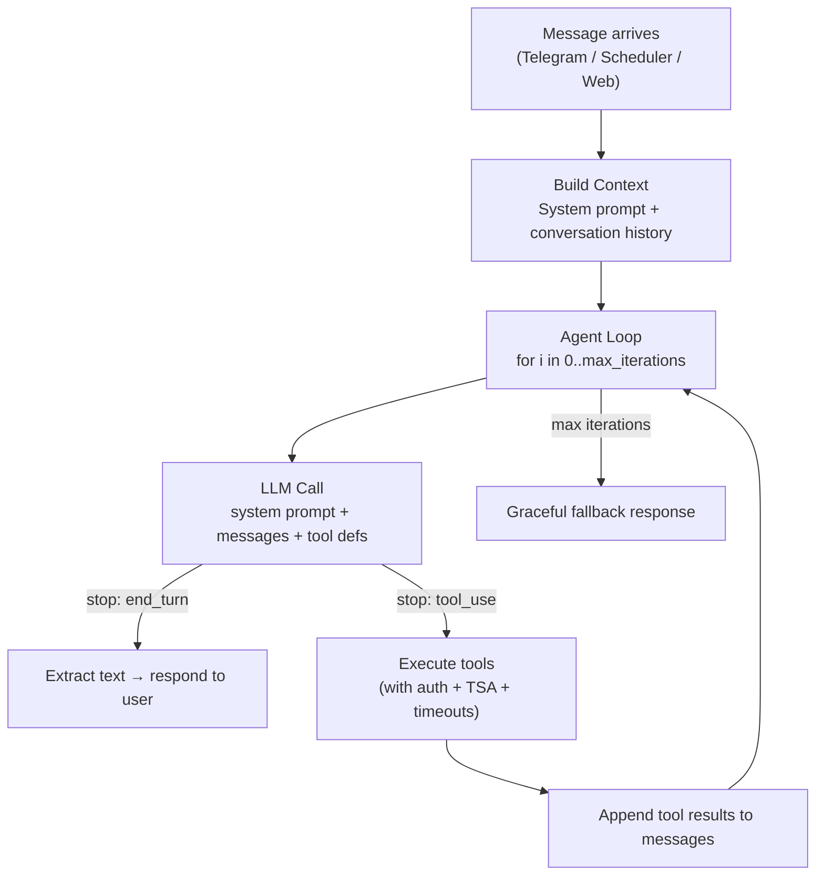

# MicroClaw Agent Loop — Architecture Review & Recreation Guide

## Overview

The agent is a **single-loop agentic system**: one LLM with tools, iterating until it produces a final text response or hits a safety cap. There is no planner, no sub-agent, no delegation — just one brain that thinks, acts, and responds.



---

## Phase 1: Context Assembly

Before the loop starts, the system builds everything the LLM needs to know.

### 1.1 System Prompt Construction

[build_system_prompt()](file:///home/ken/big_storage/projects/home-bot/src/channels/telegram.rs#L1295-L1411) assembles these sections in order:

| Section | Source | Purpose |
|---------|--------|---------|
| Identity + timezone | Config | "You are {bot_username}..." with current time |
| Capabilities | Hardcoded text | Lists all tool categories the agent can use |
| Agent Skills | `build_skills_catalog()` | Available skills with invocation commands |
| Principles | `AGENTS.md` | User-defined rules and identity |
| Memory | Tiered MEMORY.md + daily log | Per-persona context from past conversations |
| Vault paths | Config | Vector DB endpoints, search tools |

### 1.2 Conversation History

Two paths to load history:

- **Session resume** — deserialize saved session JSON, append new messages since last save
- **DB history** — load from stored messages table, convert to LLM message format

Then: `trim_to_recent_balanced()` keeps a small recent window, and `compact_messages()` summarizes old messages if the session exceeds `max_session_messages`.

### 1.3 Tool Registry

[ToolRegistry::new()](file:///home/ken/big_storage/projects/home-bot/src/tools/mod.rs#L281-L403) registers all tools:

```
bash, browser, read_file, write_file, edit_file, glob, grep,
read_memory, write_memory, web_fetch, web_search, send_message,
schedule_task, list_tasks, pause/resume/cancel_task, get_task_history,
export_chat, cursor_agent, cursor_agent_send, list_cursor_agent_runs,
build_skill, activate_skill, sync_skills,
read_tiered_memory, write_tiered_memory, search_chat_history,
search_vault, add_vault_item (conditional),
fetch_tiktok/instagram/linkedin_feed (conditional)
```

---

## Phase 2: The Agent Loop

[Lines 986–1282](file:///home/ken/big_storage/projects/home-bot/src/channels/telegram.rs#L986-L1282) — the core loop.

```
for iteration in 0..max_tool_iterations:
    response = LLM(system_prompt, messages, tool_defs)    // 180s timeout

    if response.stop_reason == "end_turn":
        return response.text                               // Done!

    if response.stop_reason == "tool_use":
        for each tool_call in response:
            TSA gate (optional) → approve or deny
            result = execute_with_auth(tool, input, auth)  // 120s timeout
            append result to tool_results
        append assistant message (tool calls) to messages
        append user message (tool results) to messages
        continue                                           // Next LLM call

return "max iterations reached"                            // Safety cap
```

### 2.1 LLM Call

- **Provider abstraction**: `state.llm.send_message()` — supports Claude, OpenAI, etc. via the `LlmProvider` trait
- **Timeout**: 180s per LLM round; returns fallback message on timeout
- **Input**: system prompt (string), messages (array), tool definitions (array)
- **Output**: `LlmResponse` with `content` blocks (Text or ToolUse) and `stop_reason`

### 2.2 Stop Reason Routing

| `stop_reason` | Action |
|---|---|
| `end_turn` | Extract text, save session, return to user |
| `max_tokens` | Same as end_turn (model hit context limit) |
| `tool_use` | Execute tools, append results, loop again |
| Other | Extract text, save session, return |

### 2.3 Tool Execution Pipeline

Each tool call goes through three gates:

```
1. TSA (Tool Skill Agent)     — optional LLM-based gating: should this tool be called?
2. Auth (approval tokens)     — high-risk tools (bash) require a 2-step approval token
3. Execution with timeout     — 120s timeout per tool; timeout → error result
```

**TSA** (`evaluate_tool_use`): A separate LLM call that evaluates whether a tool call is appropriate given the conversation. Can deny with a reason. Only active when `tool_skill_agent_enabled = true`.

**Auth** (`execute_with_auth`): For high-risk tools (`bash`), the system issues an approval token. The LLM must re-call the tool with that token to proceed. This is a 2-round handshake.

**Timeout handling**: If a tool times out, the error is fed back to the LLM, which can try an alternative. After 3+ timeouts, the loop bails entirely.

### 2.4 Message Format (Claude API)

```
messages = [
  { role: "user",      content: "Run the jsearch job" },
  { role: "assistant", content: [ToolUse { id, name: "bash", input: {...} }] },
  { role: "user",      content: [ToolResult { tool_use_id, content: "..." }] },
  { role: "assistant", content: "Here are your job results..." },
]
```

Tool calls and results are paired via `tool_use_id`. The assistant message contains ToolUse blocks; the next user message contains matching ToolResult blocks.

### 2.5 Session Persistence

After every terminal response (end_turn, timeout, max iterations), the full message history is serialized to JSON and saved to the DB. On the next message, it's resumed from where it left off.

---

## Phase 3: Entry Points

### Telegram Message
```
handle_message() → process_with_agent() → process_with_agent_with_events()
```

### Scheduled Task
```
scheduler::run_due_tasks() → process_with_agent(override_prompt: "run jsearch job")
```

The scheduler adds `[scheduler]: {prompt}` as a user message (line 915), so the agent sees it as a normal user request and executes with the same loop.

### Web API
```
POST /api/chat → web::handle_chat() → process_with_agent_with_events()
```

All three entry points use the exact same agent loop.

---

## Recreation Guide

### Minimal Implementation (Pseudocode)

```python
def agent_loop(user_message: str, config: Config) -> str:
    # 1. Build system prompt
    system_prompt = build_system_prompt(
        identity=config.bot_name,
        timezone=config.timezone,
        skills=load_skills_catalog(),
        memory=load_memory(config.persona_id),
        principles=read_file("AGENTS.md"),
    )

    # 2. Load or create conversation history
    messages = load_session() or []
    messages.append({"role": "user", "content": user_message})

    # 3. Register tools
    tools = register_all_tools(config)

    # 4. Agent loop
    MAX_ITERATIONS = 20
    for i in range(MAX_ITERATIONS):
        response = llm.send(
            system=system_prompt,
            messages=messages,
            tools=tools.definitions(),
        )

        # 4a. Terminal: model wants to respond
        if response.stop_reason == "end_turn":
            save_session(messages + [assistant_msg(response.text)])
            return response.text

        # 4b. Tool use: execute and continue
        if response.stop_reason == "tool_use":
            # Append assistant message with tool calls
            messages.append(assistant_msg(response.content))

            # Execute each tool
            results = []
            for tool_call in response.tool_calls:
                result = tools.execute(tool_call.name, tool_call.input)
                results.append(tool_result(tool_call.id, result))

            # Append tool results as user message
            messages.append({"role": "user", "content": results})
            continue

    return "Max iterations reached."
```

### Key Design Decisions

| Decision | Rationale |
|---|---|
| **Single loop, no planner** | Simplicity; the LLM itself plans via its reasoning |
| **All tools available** | Agent can do anything in one loop — no restricted registries |
| **Timeout per LLM call + per tool** | Prevents indefinite hangs on either side |
| **Session persistence** | Conversation state survives restarts |
| **Message compaction** | Prevents context overflow on long conversations |
| **Skills in system prompt** | Agent knows HOW to invoke skills without discovery |
| **TSA gating (optional)** | Extra safety layer — a second LLM evaluates tool calls |
| **Approval tokens for bash** | Prevents unsafe bash execution without confirmation |

### What You Need to Build

1. **LLM Provider** — abstraction over Claude/OpenAI/etc. with `send_message(system, messages, tools)`
2. **Tool Registry** — register tools, generate JSON Schema definitions, execute by name
3. **Tool Auth** — approval tokens for high-risk tools, auth context injection
4. **Session Store** — save/load message arrays (JSON in SQLite works)
5. **System Prompt Builder** — assemble identity, capabilities, skills, memory, principles
6. **Skills Manager** — discover SKILL.md files, build catalog with invocation details
7. **Memory Manager** — tiered memory (MEMORY.md) + daily logs
8. **Entry Points** — Telegram bot handler, scheduler cron runner, web API
