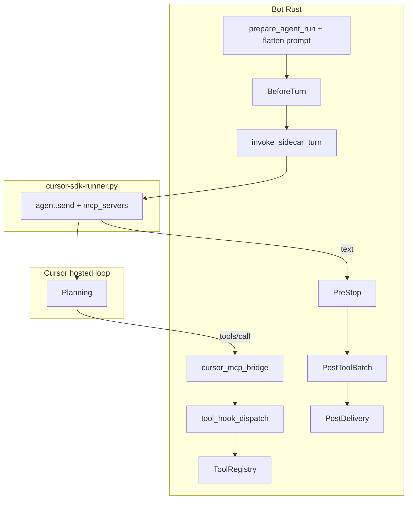

# Cursor engine integration (tools, skills, hooks)

How the bot's **ToolRegistry**, **skills**, and **bot-native hooks** are linked when **Settings → Runtime → Agent engine** is **Cursor**.

This is **not** a sync to Cursor IDE artifacts (`.cursor/rules`, `.cursor/hooks.json`, `~/.cursor/skills`). The bot keeps a single source of truth in Rust/SQLite/workspace and bridges Cursor through **prompt text** plus a **loopback MCP server**.

## Mental model

| Concept | What connects to Cursor | Mechanism |
| --- | --- | --- |
| **Core tools / capabilities** | Yes — execution | Loopback MCP exposes `ToolRegistry` to the Cursor SDK agent |
| **Skills** | Guidance + execution | Catalog in flattened prompt; `activate_skill` / `run_skill_script` as MCP tools |
| **Hooks** | Policy at turn/tool boundaries | Same `hook_runtime` as Classic; tool hooks run inside MCP `tools/call` |

**MCP connects tools, not hooks.** Hooks are Rust policy that runs at fixed points. Tool-related hooks (`PreToolUse`, `PostToolUse`) fire when Cursor invokes an MCP tool. Turn hooks (`BeforeTurn`, `PreStop`, `PostDelivery`) and `PostToolBatch` run in `cursor_engine.rs` without going through MCP.

See also: [`hooks-architecture.md`](hooks-architecture.md) (hook catalog and storage), [`agent-harness-research.md`](agent-harness-research.md) (engine comparison and SDK layers).

## Prerequisites

| Requirement | Why |
| --- | --- |
| `AGENT_ENGINE=cursor` (Settings → Runtime) | Selects `run_cursor_engine` instead of Classic loop |
| `WEB_ENABLED=true` | MCP endpoint is mounted on the web server |
| `CURSOR_API_KEY` in repo-root `.env` | Sidecar (`cursor-sdk-runner.py`) authenticates to Cursor API |
| Settings → Cursor: **Expose bot tools (MCP)** on (default) | Registers MCP config on each sidecar `agent.send` |
| Sidecar reachable (`CURSOR_SDK_RUNNER_URL`) | Rust POSTs `/run` and receives NDJSON stream |

If MCP is disabled or Web UI is off, the Cursor turn still gets **prompt-injected** principles/skills catalog, but **bot tools do not execute** during the turn (no bulletin updates, no skill scripts, no tool hooks).

## Architecture

```text
Telegram / Web / Discord / Scheduler
       │
       ▼
process_with_agent_with_events  (shared entry)
       │
       ▼
run_cursor_engine  (src/cursor_engine.rs)
       │
       ├─ BeforeTurn hooks  (hook_turn_bridge)
       ├─ prepare_agent_run → flatten_turn_prompt  (tools/skills/principles in text)
       ├─ Register run-scoped MCP token  (cursor_mcp_bridge)
       │
       ▼
HTTP POST /run  →  cursor-sdk-runner.py
       │              agent.send(prompt, { mcp_servers: { finally-a-value-bot: … } })
       ▼
Cursor hosted agent loop  (remote planning)
       │
       │  tools/list, tools/call
       ▼
POST http://127.0.0.1:{WEB_PORT}/internal/cursor-mcp  (loopback only)
       │
       ├─ PreToolUse  → tool_hook_dispatch → hook_runtime
       ├─ ToolRegistry.execute_with_auth
       ├─ PostToolUse → tool_hook_dispatch → hook_runtime
       │
       ▼
NDJSON text (+ optional tool_use / tool_result events) back to Rust
       │
       ├─ PreStop hooks  (hook_turn_bridge)
       ├─ PostToolBatch  (cursor_mcp.finish_run)
       ├─ Append assistant message to messages
       └─ pipeline_finish_turn  → PostDelivery hooks, history, PDQE
```



## Core tools and capabilities (MCP)

### Registration per turn

At the start of each Cursor turn (`run_cursor_engine`):

1. `CursorMcpRegistry::register_run` stores `run_key`, `ToolAuthContext`, chat/persona/channel, and a random Bearer token (TTL ~1 hour).
2. Rust builds inline MCP config: `http://127.0.0.1:{WEB_PORT}/internal/cursor-mcp` with `Authorization: Bearer <token>`.
3. The sidecar passes `mcp_servers` on **every** `agent.send` (not persisted across resume by the SDK).

### MCP protocol surface

| Method | Handler | Behavior |
| --- | --- | --- |
| `initialize` | `cursor_mcp_bridge` | Server capabilities |
| `tools/list` | Maps `ToolRegistry::definitions()` | Strips internal `__finally_a_value_bot_auth` from schemas; auth injected server-side |
| `tools/call` | `dispatch_tool_with_hooks` → `execute_with_auth` | Full tool execution with hooks |

### Default denylist (Cursor MCP)

These tools are **not** exposed to Cursor MCP (avoid recursion and duplicate delivery):

- `cursor_agent`
- `cursor_agent_send`
- `list_cursor_agent_runs`

`send_message` is denied unless **Settings → Cursor → Allow send_message via MCP** is enabled.

### Security

- Endpoint accepts **loopback clients only** (`127.0.0.1` / `::1`).
- Requires valid run-scoped Bearer token; revoked when the turn finishes.
- Tool args are redacted via `EnvSecretRedactor` in logs.

### Key files

| File | Role |
| --- | --- |
| [`src/cursor_mcp_bridge.rs`](../src/cursor_mcp_bridge.rs) | Registry, JSON-RPC handler, `tools/list` / `tools/call` |
| [`src/tool_hook_dispatch.rs`](../src/tool_hook_dispatch.rs) | Shared PreToolUse / PostToolUse / PostToolBatch for MCP (and future Classic reuse) |
| [`src/cursor_engine.rs`](../src/cursor_engine.rs) | Turn orchestration, MCP registration, finish path |
| [`scripts/cursor-sdk-runner.py`](../scripts/cursor-sdk-runner.py) | Passes `mcp_servers`, streams tool events |
| [`src/web.rs`](../src/web.rs) | Route `POST /internal/cursor-mcp` |

## Skills

Skills use **two layers** — same as Classic, but Cursor execution goes through MCP.

### 1. Guidance (prompt)

`prepare_agent_run()` builds the system prompt before the sidecar runs:

- `AGENTS.md` principles
- Persona-filtered **skills catalog** from `workspace/skills/` (`SkillManager::build_skills_catalog_for_allowed`)
- Bulletin, memory, vault paths, SOP pointers

`build_cursor_prompt()` flattens system + conversation (including `[hook_context]` from BeforeTurn) into one text blob for the Cursor SDK. The sidecar cwd is the **persona shared dir** (`shared/personas/{chat}/{persona}/`), not the git repo root.

The model learns **what skills exist and when to use them** from this text. That alone does not run scripts or enforce gates.

### 2. Execution (MCP tools)

| Tool | Purpose |
| --- | --- |
| `activate_skill` | Load `SKILL.md`, return instructions; may hint `run_skill_script` |
| `run_skill_script` | Execute a script under the skill directory |

Both are normal `ToolRegistry` tools listed via MCP `tools/list` and executed via `tools/call` with the same `ToolAuthContext` as Telegram/web.

### Skill gate (hook + runtime)

`pretool-turn-skill-gate` (`builtin_turn_skill_gate`) runs on **PreToolUse** inside `tool_hook_dispatch`:

- `schedule_task` / `update_scheduled_task` require `activate_skill` for `schedule-job` earlier in the turn.
- Skill-mutating tools require `activate_skill` for `modify-skill` when applicable.

`tool_hook_dispatch` passes `runtime_signals` (`requires_schedule_skill`, `requires_modify_skill`) into the hook — same as Classic. Blocked tools return an MCP error to Cursor (often `skill_required: …`).

Skills are **not** mirrored to `~/.cursor/skills` or `.cursor/skills`. Canonical tree: `workspace/skills/` (and persona policy in SQLite).

## Hooks

Bot hooks are defined in SQLite (`hook_definitions`) and evaluated by `hook_runtime::run_hooks_for_event_async`. They are **not** Cursor IDE `.cursor/hooks.json` hooks.

### Parity matrix (Cursor vs Classic)

| Event | Cursor engine | Where it runs |
| --- | --- | --- |
| `BeforeTurn` | Yes | `hook_turn_bridge` before sidecar; may block or inject `[hook_context]` into prompt |
| `PreToolUse` | Yes | Inside MCP `tools/call` via `tool_hook_dispatch` |
| `PostToolUse` | Yes | Inside MCP `tools/call` after tool result |
| `PostToolBatch` | Yes | `cursor_mcp.finish_run` after sidecar completes (one batch per sidecar invocation) |
| `PreStop` | Yes | `hook_turn_bridge` after sidecar text; deferred-commitment nudge loop (max 2 resumes) |
| `PostDelivery` | Yes | `pipeline_finish_turn` — focus sync, PDQE, history |

Shipped builtins that matter for tool-heavy personas: `pretool-turn-skill-gate`, `postbatch-loop-guard`, `postdelivery-persona-focus-sync`, `prestop-deferred-commitment-guard`, `beforeturn-scheduler-policy-context`. See [`hooks-architecture.md`](hooks-architecture.md).

### Finish-path note

Before `pipeline_finish_turn`, Cursor engine **appends the delivered assistant message** to `messages`. PostDelivery hooks (e.g. persona focus sync) need that text in context — this was missing before the MCP bridge work.

## Turn lifecycle (ordered)

1. **BeforeTurn** — policy context or block.
2. **Prompt build** — full prep for finish path; sidecar gets slim or resume-delta delegation prompt (see Context deduplication).
3. **MCP register** — run token + inline `mcp_servers` for sidecar.
4. **Sidecar** — `agent.send`; Cursor remote loop may call MCP tools.
5. **Per MCP tool** — PreToolUse → execute → PostToolUse.
6. **PreStop** — end-turn guard; optional nudge + resume with same `agent_id`.
7. **PostToolBatch** — loop/discovery stall hints from batch stats.
8. **Append assistant** to `messages`.
9. **PostDelivery** — `pipeline_finish_turn` (bulletin focus sync, quality gate, history).

Agent history records a synthetic iteration with tool rows when MCP tools ran (`had_tool_calls` set for focus-sync heuristics).

## Context deduplication (Cursor-only)

Classic and Deterministic engines still receive the full `build_system_prompt` output unchanged. Only the **sidecar delegation prompt** is shaped in [`src/cursor_delegation_prompt.rs`](../src/cursor_delegation_prompt.rs) inside `run_cursor_engine`.

| Mode | When | Sidecar receives |
| --- | --- | --- |
| **Full slim** | First turn, scheduled tasks, stale-agent retry, or resume-delta disabled | Slim system prompt (tool catalog stripped when MCP on) + full `hook_messages` flatten |
| **Resume delta** | Resumed Cursor session (`agent_id` in DB) on interactive turns | Minimal runtime header + trusted delta messages only (`[system_runtime_context]`, `[persona_context]`, `[session_context]`, `[current_request]`, `[hook_context]`) |

**Unchanged for finish path:** `prep.system_prompt` (full) still feeds `pipeline_finish_turn`, PDQE, and agent history.

**Slim prompt** (`delegation_slim_prompt`, default on): when MCP is live, replaces the `## Tool groups` prose block with a short MCP delegation section pointing at `finally-a-value-bot`. Shortens the `# Agent Skills` intro but keeps `<available_skills>` metadata for routing.

**Resume delta** (`delegation_resume_delta`, default on): avoids re-sending principles + full chat history when Cursor retains session memory via `agent_id`. Scheduled jobs always use full slim.

**Stale agent id:** if the sidecar reports a missing `agent_id`, the DB id is cleared and the turn retries once with a **full slim** prompt (not delta).

Pipeline stage telemetry includes `delegation=full_slim|resume_delta|full_slim_stale_retry` and `prompt_chars=…`.

## Settings and operations

| Surface | Keys / behavior |
| --- | --- |
| Settings → Runtime | `agent_engine=cursor` |
| Settings → Cursor | Model, sidecar health, **Expose bot tools (MCP)**, optional **send_message**, **slim sidecar prompt**, **resume delta prompts** |
| DB app_settings | `CURSOR_MCP_TOOLS_ENABLED`, `CURSOR_MCP_EXPOSE_SEND_MESSAGE`, `CURSOR_DELEGATION_SLIM_PROMPT`, `CURSOR_DELEGATION_RESUME_DELTA` |
| Doctor | `cursor_engine.mcp_bridge` when engine is Cursor |
| API | `GET/PATCH /api/cursor-engine` includes `mcp_endpoint_url`, `mcp_bridge_ready` |

## What is intentionally not synced

| Cursor-native artifact | Why not used as source of truth |
| --- | --- |
| `.cursor/rules` | Principles already in prompt; SDK does not load project rules by default (`setting_sources` empty) |
| `.cursor/hooks.json` | Different event model; no persona scope; no `builtin_*` Rust handlers |
| `.cursor/skills` / IDE skills | Execution requires bot `activate_skill` / `run_skill_script`; cwd is persona dir |
| Cursor built-in tools only | No `update_bulletin_focus`, vault, scheduler, channel tools |

Optional future work: read-only export of a slim rules snippet into persona cwd — **supplement only**, not a replacement for MCP.

## Classic fallback

If the sidecar is unreachable (non-scheduled interactive turns), Cursor engine may **fallback to Classic** with a warning. Scheduled tasks fail closed when Cursor is required but unavailable.

## Related documentation

| Topic | Doc |
| --- | --- |
| Hook catalog, storage, builtins | [`hooks-architecture.md`](hooks-architecture.md) |
| Engine comparison, SDK blackbox layers | [`agent-harness-research.md`](agent-harness-research.md) |
| Implementation log (2026-07-03) | [`development-journal.md`](development-journal.md) |
| Local delegate / cost routing (orthogonal) | [`local-delegate-routing.md`](local-delegate-routing.md) |
