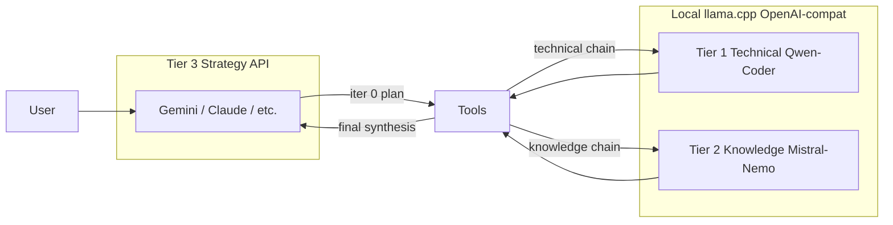

# Multi-model local tiers — consistent tool calling across installs

Operator and architecture guide for **Tier 1 (technical)** and **Tier 2 (knowledge)** local llama.cpp servers, **Tier 3 (strategy)** cloud/API models, and reliable tool use when the bot is installed on a new machine.

**Related code:** `src/multimodel.rs`, `src/llm.rs`, `src/channels/telegram.rs` (shared agent entry), `src/web.rs` (`/api/multimodel`), `web/src/components/settings-multimodel.tsx`.

**See also:** development journal entries *Multi-model routing* and *Local tier tool calling* in [`development-journal.md`](development-journal.md).

---

## Goals

| Goal | Meaning |
|------|---------|
| **Safe default** | Fresh install behaves like single-LLM bot until operator explicitly enables and verifies local tiers |
| **Wire consistency** | Local OpenAI-compatible servers return parseable `tool_calls`, not tool JSON buried in `content` |
| **Behavioral resilience** | Wrong local tool choice or failed local step does not strand the user — strategy tier recovers |
| **Portable setup** | Same checklist works on any host; URLs/models live in `app_settings`, not in git |

---

## Architecture (three tiers)



| Tier | Role | Typical model | Server |
|------|------|---------------|--------|
| **1 — Technical** | Shell, file edits, grep/glob, skill scripts | Qwen2.5-Coder-14B (or similar) | Local `:8080/v1` |
| **2 — Knowledge** | Vault search, tiered memory, summarization | Mistral-Nemo-12B (or similar) | Local `:8081/v1` (separate instance recommended) |
| **3 — Strategy** | First turn, planning, user-facing delivery, final synthesis | Configured in **Settings → LLM** | Cloud / API |

**Routing is automatic** in the shared agent loop (`process_with_agent` in `src/channels/telegram.rs`). Operators do not pick a tier per message.

### When each tier runs

- **Always strategy:** iteration 0, final synthesis (PTE complete), max-iteration pass, conversational turns.
- **Tier 1:** previous iteration used only *technical* tools (e.g. `bash` + `read_file` on source files) and multimodel is enabled + Tier 1 verified.
- **Tier 2:** previous iteration used only *knowledge* tools and Tier 2 verified.
- **Stay on strategy:** after local-tier tool errors (`local_tier_error_streak`), strategy fallback on bad local `end_turn`, or when `tools_ok` flags are false.

All channels (Telegram, web, Discord, WhatsApp, scheduler) use the same routing logic.

---

## Two layers of “tool consistency”

Operators often conflate these. Both matter.

### Layer 1 — Wire protocol (can the server emit `tool_calls`?)

**Symptom when broken:** Model returns `<tools>{...}</tools>` in `content`, `tool_calls: null`, `finish_reason: stop`. Bot treats response as plain text → hallucinated actions.

**Requirements:**

| Requirement | Notes |
|-------------|--------|
| Recent **llama.cpp** with **`--jinja`** | Required for Hermes/Qwen and Mistral Nemo tool templates |
| Correct **model id** in API requests | Alias in Settings must match what `/v1/models` lists |
| **`tool_choice`** on requests | Bot sends **`required`** for Tier 1 (Qwen), **`auto`** for Tier 2 (Mistral) when tools are offered |

**Bot-side mitigations (already implemented):**

- `tool_choice_for_tier()` in `src/multimodel.rs`
- `parse_embedded_tool_calls_from_content()` — promotes Qwen `<tools>` markup if server regresses
- Settings **Test** runs `test_multimodel_tools()` — same `tool_choice` as production

### Layer 2 — Behavior (does the model pick the right tool?)

**Symptom when broken:** Valid `tool_use`, but wrong tool (e.g. `read_file` on a `.png` when user asked to *see* an image).

**Mitigations (already implemented):**

- Listing-only `bash` / `glob` → next iteration stays on **strategy** (delivery/synthesis)
- Local tier consecutive all-error iterations → force **strategy** on next iteration
- `read_file` rejects common binary/image extensions with guidance to use markdown image paths
- Strategy fallback when local tier returns `end_turn` without tools after tool results and text claims unbacked actions

**Not yet implemented (roadmap):** tier-restricted tool lists, behavioral probe chains, auto-probe on gateway start.

---

## Fresh install on a new machine

### Default (no local tiers)

- **Multi-model routing is disabled.**
- All agent iterations use **Settings → LLM** only.
- Behavior is consistent across machines; no llama.cpp required.

### Enabling local tiers (operator checklist)

1. **Strategy LLM** — Settings → LLM: provider, model, API key (e.g. Google Gemini or Anthropic Claude).
2. **Local servers** — Start one or two llama.cpp OpenAI-compatible instances (see [Reference server setup](#reference-server-setup)).
3. **Settings → Multi-model** — Enter Tier 1 and Tier 2 base URL (e.g. `http://127.0.0.1:8080/v1`) and model id for each.
4. **Test both tiers** — Click *Test technical server* and *Test knowledge server*. Each must show **Tool calling: verified**.
5. **Enable routing** — Toggle on and save. UI and API **block** enable until both `tools_ok` flags are true.
6. **Smoke test** — One agent turn that uses tools; inspect **Last agent run** for `Model tier:` lines per iteration.

Changing a tier URL or model **clears** that tier’s `tools_ok` until re-tested.

### What is stored where

| Storage | Keys / content |
|---------|----------------|
| SQLite `app_settings` | `MULTIMODEL_ENABLED`, `MULTIMODEL_TIER1_BASE_URL`, `MULTIMODEL_TIER1_MODEL`, `MULTIMODEL_TIER2_*`, `MULTIMODEL_TIER1_TOOLS_OK`, `MULTIMODEL_TIER2_TOOLS_OK` |
| Not in git | URLs, model aliases, probe results — per deployment |
| Agent history | Per-run tier lines under `workspace/runtime/groups/<chat_id>/<persona_id>/agent_history/` |

---

## Reference server setup

Canonical layout used in production debugging (adjust IPs/ports per host):

| Instance | Port | Model (example) | Context |
|----------|------|-----------------|---------|
| Tier 1 | `8080` | `qwen2.5-coder:14b` | 32768 |
| Tier 2 | `8082` or `8081` | `mistral-nemo:12b` | 128000 |

**llama-server checklist:**

1. Build recent llama.cpp; launch with **`--jinja`**.
2. Confirm `GET /health` (or equivalent) and `GET /v1/models` list expected model ids.
3. **Tier 1 curl probe** (must include `tool_choice`):

```bash
curl -s http://HOST:8080/v1/chat/completions -H 'Content-Type: application/json' -d '{
  "model": "qwen2.5-coder:14b",
  "messages": [{"role": "user", "content": "Use add to compute 2+3"}],
  "tools": [{"type": "function", "function": {"name": "add", "description": "add",
    "parameters": {"type": "object", "properties": {"a": {"type": "integer"}, "b": {"type": "integer"}}, "required": ["a", "b"]}}}],
  "tool_choice": "required"
}'
```

Expect `tool_calls` array and `finish_reason: tool_calls`. Without `tool_choice`, Qwen-Coder often **fails** even when the server is otherwise healthy.

4. **Tier 2 curl probe** — same payload with `"tool_choice": "auto"` against the Mistral endpoint.

**Multi-model router:** A single llama-server can expose multiple models on one port if `/v1/models` lists both; otherwise run **separate processes** on 8080 and 8081/8082.

---

## Bot verification (Settings → Multi-model Test)

`POST /api/multimodel/test` performs:

1. Connectivity (`test_model` / models list for local providers).
2. Tool probe (`test_multimodel_tools`) — minimal `add` tool with tier-appropriate `tool_choice`.
3. On success — persist `MULTIMODEL_TIER*_TOOLS_OK=true` and hot-reload `LlmHandle` multimodel config.

**Routing gate:** `resolve_route()` only sends work to Tier 1/2 when `tier*_routable()` → configured **and** `tools_ok`. Learn & Optimize (`run_optimizer.rs`) requires Tier 2 routable.

---

## Agent-loop safety nets

| Mechanism | Trigger | Effect |
|-----------|---------|--------|
| `tools_ok` gate | Routing decision | Local tiers skipped if probe not passed |
| `tool_choice` per tier | Every local LLM call with tools | Qwen `required`, Mistral `auto` |
| `<tools>` content parser | Qwen returns markup in `content` | Promote to `ToolUse` blocks |
| Listing-only routing | Last tools only `bash` or `glob` | **Removed** — routes to technical tier; use error-streak + strategy fallback if local model misbehaves |
| `local_tier_error_streak` | All tool results errored on local tier | Next iteration → strategy |
| Strategy tool fallback | Local `end_turn`, no tools, after tool results, unbacked action claims | One retry on strategy tier |
| `read_file` binary guard | Path ends in `.png`, `.jpg`, etc. | Clear error; do not read as UTF-8 |

---

## Troubleshooting

| Symptom | Likely cause | Action |
|---------|--------------|--------|
| Multi-model enable blocked | `tools_ok` false | Run Test for both tiers |
| Tier test: connectivity OK, tools fail | Missing `--jinja`, wrong model id, or Qwen without `tool_choice` on server | Fix server; bot already sends `tool_choice` — verify with curl above |
| Agent history: technical tier, `end_turn`, no tools, fake URLs | Layer 1 failure before fixes, or old binary | Upgrade bot; re-probe tiers |
| technical tier, `read_file` ERR on `.png` | Layer 2 — wrong tool | Expected after fix: next iter strategy; user should get image markdown from strategy |
| `loop_guard_stalled` | Repeated non-progress tools / hooks | Check iteration trace; simplify request; strategy should own “show file” flows |
| Works on machine A, not B | Different llama build, model alias, or single-port vs dual-port | Re-run Test; align model ids with `/v1/models` |

**Debug artifacts:**

- Web UI → **Last agent run** — `Model tier:` per iteration.
- `workspace/runtime/groups/<chat_id>/<persona_id>/agent_history/<timestamp>.md` — full trace.
- Gateway logs — `model_tier=`, `local_tier_error_streak=`, `tier_tool_fallback`.

---

## Cross-machine deployment guidance

### Same behavior everywhere

1. Ship the **same bot binary** and run `reload.sh` / install path on each host.
2. Use **strategy-only** unless that host runs local GPU inference.
3. Document per-host **Tier URLs and model ids** in your ops runbook (not in repo secrets).

### GPU hosts running local tiers

1. Pin **llama.cpp version** and launch flags in your infra (script, systemd, compose).
2. After any server upgrade or model swap → **re-run both tier Tests**.
3. Keep **Tier 2 on a separate port** when possible — avoids single-loaded-model ambiguity.
4. Prefer **strategy for user-visible delivery** when local tiers fail; treat local tiers as execution workers. After `bash`/`glob`, Tier 1 may run — `local_tier_error_streak` and strategy fallback cover bad follow-ups.

### Optional future hardening (not implemented)

| Item | Benefit |
|------|---------|
| Auto-probe on gateway start when multimodel enabled | Removes “forgot to click Test” |
| Reference `docker compose` for llama tiers | Same ports/models on every install |
| Tier-restricted tool registries | Fewer bad tool picks from 14B models |
| Behavioral probe (bash → follow-up) | Catches “can call one tool” but not chain |
| Cockpit status badge | Tier 1/2 verified / stale / failed at a glance |

---

## API reference (web / automation)

| Endpoint | Purpose |
|----------|---------|
| `GET /api/multimodel` | Current config + `tier1_tools_ok`, `tier2_tools_ok` |
| `PATCH /api/multimodel` | Update URLs/models/enabled; requires both probes before `enabled: true` |
| `POST /api/multimodel/test` | Body: `{ "tier": "technical" \| "knowledge", "base_url", "model" }` |

---

## Summary

**Consistent local tool use across installs** is achieved by:

1. **Disabling local routing by default** until explicit setup.
2. **Encoding server quirks in the bot** (`tool_choice`, markup parser).
3. **Proving capability before routing** (`tools_ok` probe).
4. **Never trusting local models for the full agent role** — strategy plans, delivers, and recovers.

On a new machine: configure strategy LLM → stand up llama servers with `--jinja` → Test both tiers → enable routing → smoke one tool-heavy persona turn. If anything drifts after a server upgrade, re-test; the bot will stay on strategy until probes pass again.
